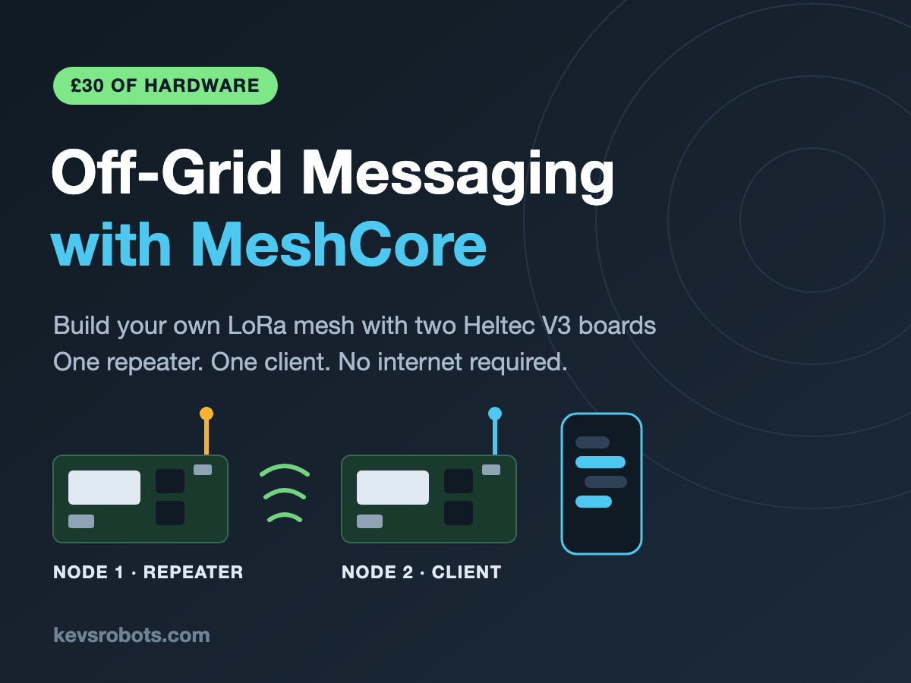

{:class="cover"}

Ahoy there makers! Imagine sending a text message to a friend three miles away with no mobile signal, no WiFi, no internet, and no monthly bill. That is exactly what we are going to build in this course - and the whole thing costs about £30.

---

## Overview

[MeshCore](https://meshcore.io) is a free, open source mesh networking system for cheap LoRa radios. You flash it onto a small ESP32 board, pair it with your phone over Bluetooth, and you have an encrypted messaging network that runs entirely on its own.

In this course we will build a **two node mesh**:

- **Node 1 - the repeater.** A board that sits high up, listens for packets and forwards them on. It has no screen you interact with and no phone attached. It just quietly extends the range of the network.
- **Node 2 - the client.** A board that pairs to your phone over Bluetooth and lets you send and receive messages.

Both nodes are the same hardware - a **Heltec WiFi LoRa 32 V3** board, which you can pick up for around **£15** each. The only difference is the firmware you flash and how you configure it.

---

## Course Content

- What MeshCore is, and how it differs from Meshtastic
- How LoRa radio actually works - spreading factor, bandwidth and coding rate
- Choosing and buying the right hardware (and the one mistake that will cost you £15)
- Antennas, ERP and what Ofcom lets you do on the 868MHz band
- Flashing MeshCore firmware with the web flasher
- Picking the correct radio settings for the UK
- Setting up node 1 as a repeater over the serial console
- Where to physically put a repeater, and how to power it
- Setting up node 2 as a BLE companion client
- Pairing the phone app and sending your first message
- Channels, group chat and the public channel key
- Flood routing versus path routing, and why MeshCore is quiet
- Administering your repeater remotely from your phone
- Troubleshooting a mesh that will not talk
- Where to go next - room servers, sensors, solar repeaters and the global map

---

## Key Results

After completing this course, you will:

- Understand the difference between LoRa, LoRaWAN and a LoRa mesh
- Be able to flash and configure any MeshCore supported board from scratch
- Have a working repeater that extends the range of your network
- Have a working phone-connected client and be able to message over it
- Know how to read RSSI, SNR and hop counts to diagnose a weak link
- Be able to join and contribute to your local MeshCore community network

---

## What you'll need

**Hardware**

- 2 x Heltec WiFi LoRa 32 V3 boards, **868MHz version** (around £15 each - the DollaTek listings on Amazon UK are the usual cheap source)
- 2 x 868MHz antennas with an IPEX / U.FL connector or a U.FL to SMA pigtail
- 1 x USB-C **data** cable (not a charge-only cable)
- Optional: a 3.7V LiPo battery with an SH1.25 2-pin connector for the repeater
- Optional: a small weatherproof box if the repeater is going outside

**Software**

- Google Chrome or Microsoft Edge (the web flasher needs WebUSB - Firefox and Safari will not work)
- The MeshCore app for Android or iOS, or the web client

**Skills**

- No soldering required
- No programming required
- If you can plug in a USB cable and type a command, you can do this

---

## How the course works

Each lesson introduces one idea, then puts it to work. Commands you type into the repeater console look like this:

```text
set name Kev-Repeater-01
```

Anything in `code style` is typed exactly as written. Values you should change for your own setup are shown in angle brackets, like `set lat <your-latitude>`.

Most lessons end with a **Try it Yourself** section, and the fiddly ones have a **Common Issues** section. Do not skip those - the troubleshooting notes are where the real learning happens.

Right then. Let's build a radio network.

---
