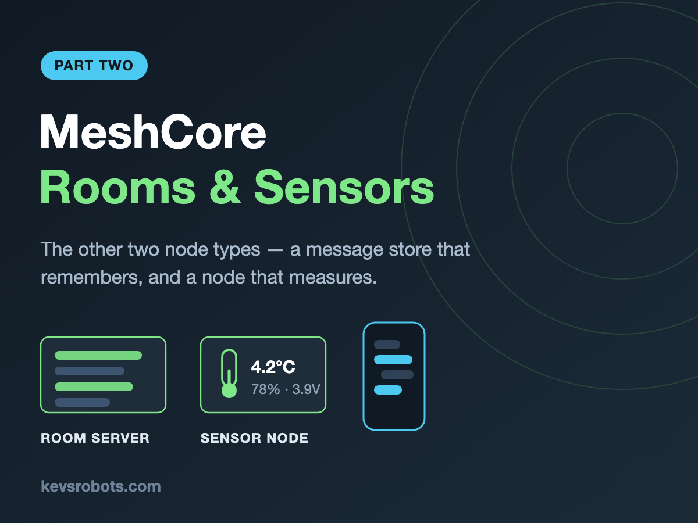

{:class="cover"}

Ahoy there makers! In [part one](/learn/meshcore/) we built a repeater and a client, and got a message across town for about £30. That course covered conversation. This one covers the other two things a mesh can do: **remember**, and **measure**.

---

## Overview

MeshCore has four roles. You have already built two of them:

| Role | What it does | Covered in |
|---|---|---|
| Companion | Your phone-connected client | Part 1 |
| Repeater | Extends range by forwarding packets | Part 1 |
| **Room Server** | Stores messages for people who were out of range | **This course** |
| **Sensor** | Reports telemetry from somewhere you are not | **This course** |
{:class="table table-single"}

The problem with a plain mesh is that it has no memory. If you were out of range when a message was sent, you missed it - permanently. A **room server** fixes that: it holds recent posts and hands them over when you come back into range.

The other gap is that a mesh only carries what a human types. A **sensor node** fills that in: a board in a greenhouse, on a water tank, or at the bottom of a field, answering questions about the physical world across kilometres with no WiFi and no subscription.

---

## Course Content

- What room servers and sensor nodes add to a mesh, and when each is worth building
- The hardware for both, including which sensors MeshCore actually supports
- Flashing and configuring a room server
- Admin passwords, guest passwords and read-only access
- Joining a room from the app, posting, and catching up on what you missed
- Permission tiers, access control lists and moderating a shared room
- Powering a room server, and the one mistake that will lose all your posts
- How MeshCore's pull-based telemetry works, and why it is so power-efficient
- Flashing a sensor node and letting it auto-detect what you have wired up
- Building a BME280 environment sensor for a greenhouse or loft
- Reporting battery and solar voltage from a remote node
- Contact and level sensing - what works out of the box, and what needs custom firmware
- Requesting telemetry from your phone and reading what comes back
- Troubleshooting both node types
- Bridging telemetry out to MQTT, Home Assistant and Grafana

---

## Key Results

After completing this course, you will:

- Have a working room server your local group can post to and catch up on
- Understand MeshCore's three permission tiers and how to apply them
- Have a working sensor node reporting real environmental data over LoRa
- Be able to request and interpret telemetry from any node in your mesh
- Know how to power both node types for long unattended runs
- Be able to get mesh telemetry into Home Assistant or Grafana

---

## What you'll need

**Prerequisite**

- [Off-Grid Messaging with MeshCore](/learn/meshcore/) - part one. This course assumes you have a working repeater and client, that your radio settings are already correct for the UK, and that you know how to reach a serial console

**Hardware**

- 1 or 2 more Heltec WiFi LoRa 32 V3 boards, **868MHz** (around £15 each) - one per role you want to build
- An 868MHz antenna for each new board
- A **BME280** breakout for the environment build (around £5)
- Optional: an **INA219** or **INA3221** breakout for proper battery and solar current monitoring
- Optional: a **VL53L0X** distance sensor for tank level
- Dupont jumper wires, four per sensor
- A USB-C **data** cable

**Skills**

- Still no soldering strictly required, though a soldered header is far more reliable than a push-fit one
- Still no programming required, unless you take the custom firmware route in lesson 13

---

## How the course works

Same as part one. Commands typed into a node's console look like this:

```text
set guest.password hedgehog
```

Values you change for your own setup appear in angle brackets, like `set name <your-room-name>`.

Every lesson has a **Try it Yourself** section and most have **Common Issues**. Let's get building.

---
