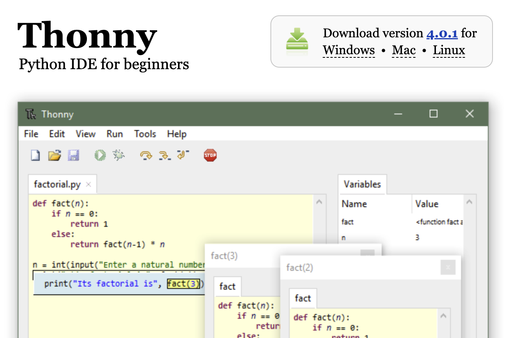
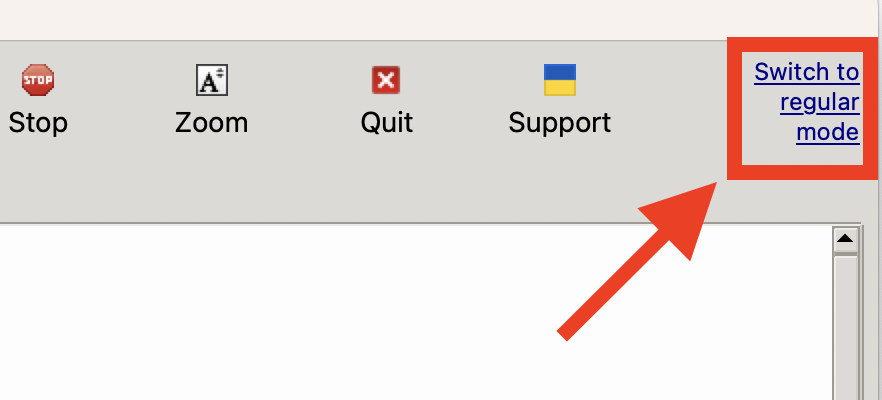
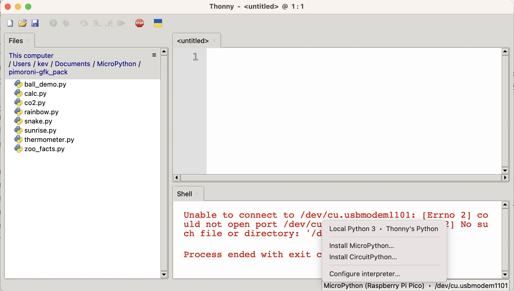
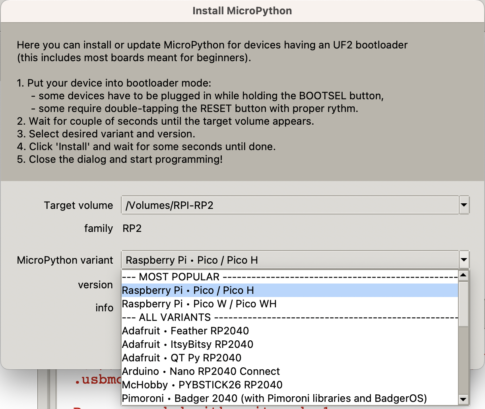

{:class="cover"}

To make installing MicroPython easier you can use `Thonny`, an Integrated Development Environment (IDE) for Python and MicroPython. To download Thonny:

1. Go <https://www.thonny.org> and download the version your computer (`Windows`, `Mac` or `Linux`).

{:class="img-fluid w-50 shadow-lg"}

Screenshot of the Thonny download page
{:.caption}

---

## Change to Standard Mode

1. After you have started `Thonny`, make sure you're in the `regular mode` by clicking on the purple text link - it will recommend that you **quit** and then **restart** `Thonny`
1. Go ahead and `quit` and `restart` Thonny.

{:class="img-fluid w-75 shadow-lg my-3"}

---

## Installing MicroPython

1. Click on on the bottom right corner and select `Install MicroPython...`

{:class="img-fluid w-75 shadow-lg my-3"}

---

{:class="img-fluid w-75 shadow-lg my-3"}

1. Select variant (the version specific to your board), for example the version for the Raspberry Pi Pico is `Raspberry Pi - Pico / Pico H`.
1. Then click the `Install` button. The firmware will now be uploaded to your microcontroller.

---

## Well done

Congratulations, you now have the most up-to-date MicroPython installed on your MicroController.

---
