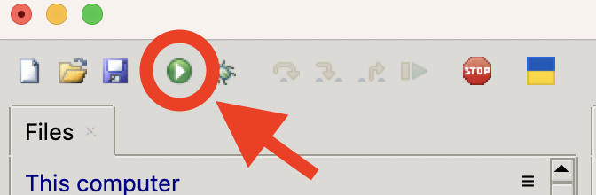

Lets create a simple program that will display the message ‘Hello World’[^1].

First, here is the code, type this into your MicroPython editor:

```python
print ('Hello World!')
```

When we run this, we will see the following printed to our screen (also refered to as the console):

``` bash
Hello World!
```

To run this in Thonny, click the green `run` button:

{:class="img-fluid w-100 shadow-lg"}

As you can see this is a very simple piece of code. The word `print` is a special word that Python understands. Python expects a line of text between the brackets, inside of the speech marks.

Notice that the `print` command is in lowercase; typing `Print` or `PRINT` will result in an error message.

We call this case sensitive; we need to ensure that the commands we type are in the correct case for Python to work properly.

Congratulations, you’re now a MicroPython programmer!

---

## Why Print?
But why do we use the word `print`? It doesn’t come out of my printer?

Back in the early days of computing there were no screens, just a form of electronic typewriter that would `print` out the results of programs running on the attached computer. These terminals were called `teleprinters` or `teletype` machines which is why serial devices in Unix have the prefix `TTY`. A lot of computing stems from these early days and still remains in some form.

We put the `hello world` message in speech marks so that the computer knows where our message `starts` and `ends`. The speech marks can be either `' ' single` or `" " double` quotes.

 We use the brackets `( )` to tell the computer that we want to run a `function` (a named block of code), the function named `print`.

Also notice that the commands are in `lowercase` - no capital letters, this is because MicroPython (and Python) are `case sensitive` meaning the words `print`, `Print` and `PRINT` are not all the same.

The print function is built-in to MicroPython, it already knows how to print things, so we don’t have to include any extra commands to make that work

---

[^1]: This is a tradition that many programming language tutorials use to help you understand how to write a simple program.