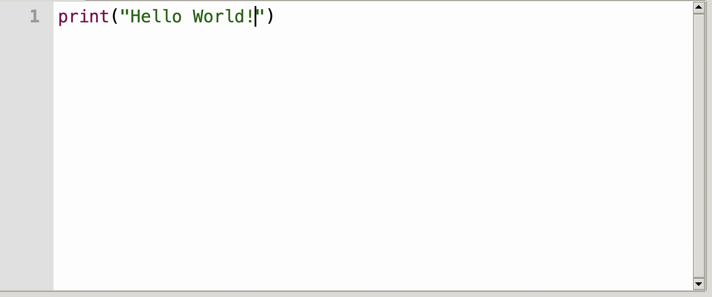
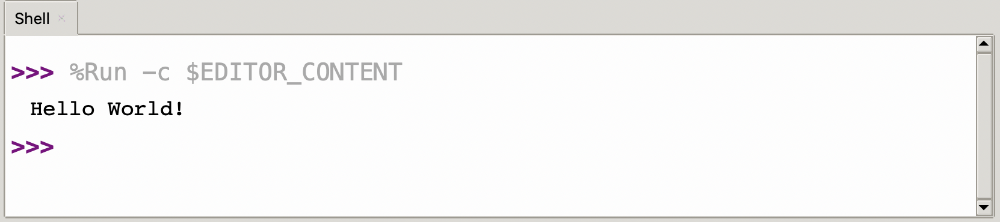

Type of the program below into your MicroPython Editor.

```python
# Hello World

print("Hello, world!")
```

In Thonny, save the file and then run it with the green `run` button.

{:class="img-fluid w-100 shadow-lg"}

{:class="img-fluid w-100 shadow-lg"}

---