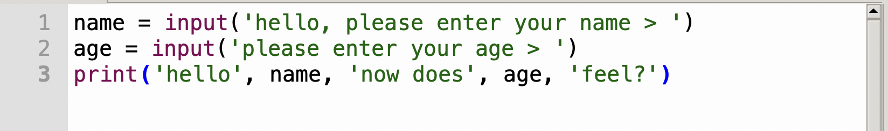
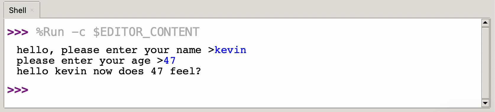

Let’s do something more interesting.

Lets make the Raspberry Pi Pico (or whichever board you are using) ask us a question, then reply back to us.

## name.py
Type of the program below into your Python Editor

```python
# Variables
# name.py

print("Please type your name:")
name = input()
print("Hello", name)
```

Save the file and then run it by pressing the green `run` button.

> ## Note
> The pound (or hash) symbol `#` means the reset of the line is a comment
> MicroPython ignores comments, so you can type useful reminders or notes to others here
> 
> ```python
> # a single line comment
>```
>
> For comments that span multiple lines, you can use 3 double quotations:
> ```python
> """ This is a multi -
> line comment """
> ```

We’ve introduced something new - the word ‘`name`’ is what we call a `variable` (something that can change). The `name` variable holds the value that it is assigned, and we assigned it by using the `=` equals sign.

The function `input`, is another built-in function that MicroPython provides to get user input from the keyboard and return it to our program.

The variable is like a box that we can put things in, in this case a persons name.

## Numbers
We can also store `numbers` in variables; let's extend our example and add an extra question

type:
```python
name = input('hello, please enter your name > ')
age = input('please enter your age > ')
print('hello', name, 'now does', age, 'feel?')
```
{:class="img-fluid w-100"}
{:class="img-fluid w-100"}

---

We can use variables in maths, for example if we want to find the missing angle in a triangle, and we have the other two angles we can use a formula - `180 - a + b = c`

type:
```python
a = 65
b = 42
c = 180 - a + b 
print(‘the missing angle is: ‘,c)
```