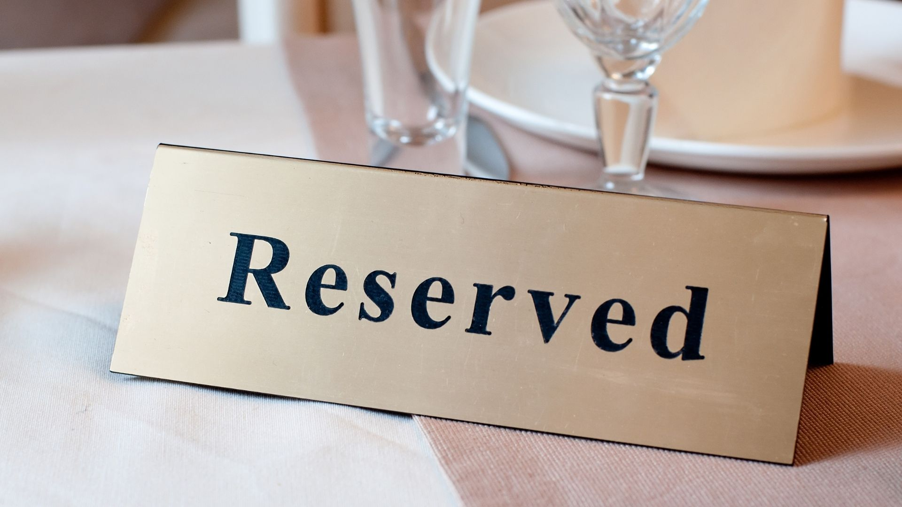

{:class="cover"}

Here is a list of all the reserved words that MicroPython understands:

| Reserved Words |         |          |            |          |            |
|:--------------:|:-------:|:--------:|:----------:|:--------:|:----------:|
|     `and`      |  `as`   | `assert` |  `break`   | `class`  | `continue` |
|     `def`      |  `del`  |  `elif`  |   `else`   | `except` |   `exec`   |
|   `finally`    |  `for`  |  `from`  |  `global`  |   `if`   |  `import`  |
|      `in`      |  `is`   | `lambda` | `nonlocal` |  `not`   |    `or`    |
|     `pass`     | `raise` | `return` |   `try`    | `while`  |   `with`   |
|    `yield`     | `True`  | `False`  |   `None`   |          |            |
{:class="table-w100 table table-bordered"}

We'll dive into some of these in more detail later. 
