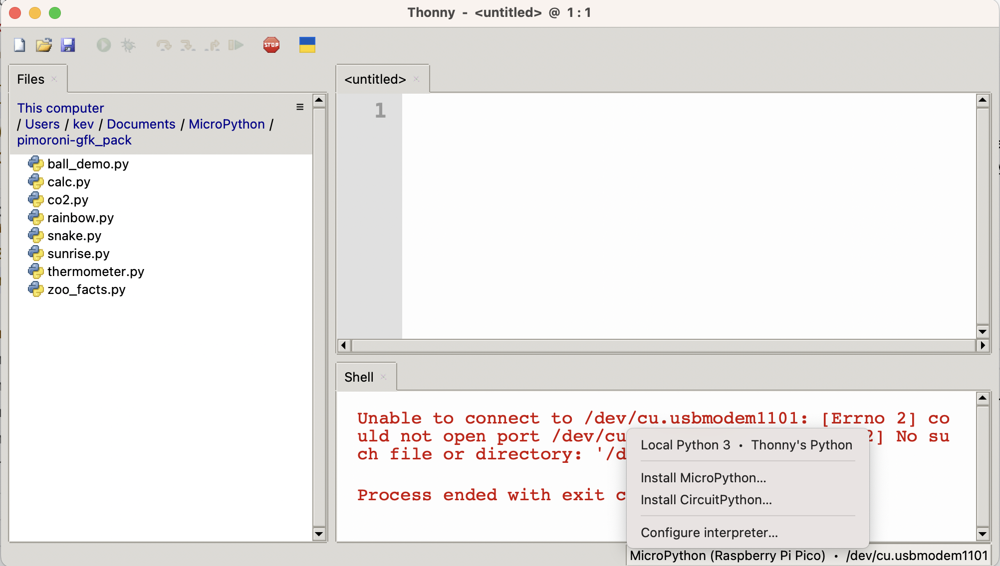

To make installing MicroPython easier you can use `Thonny`, which is an Integrated Development Environment (IDE) for Python and MicroPython. To download Thonny, go <https://www.thonny.org> and download the version your computer (`Windows`, `Mac` or `Linux`).

{:class="img-fluid w-75 shadow-lg"}

---

## Installing MicroPython with Thonny

{:class="img-fluid w-75 shadow-lg"}

Congratulations, you now have the most up-to-date MicroPython installed on your MicroController.

