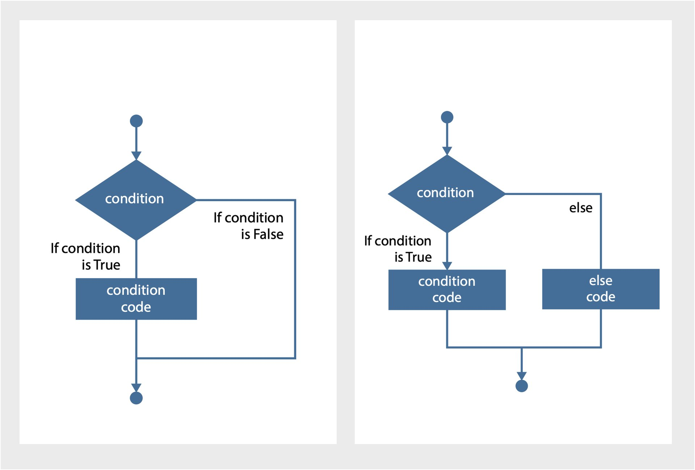

The `If` statement will evalute (check or test) if a condition is `True` or `False`.

If the statement is `True` it will run a block of code.

If the statement is `False` it will not run the block of code and continue the normal flow of the program.

{:class="img-fluid w-100"}
