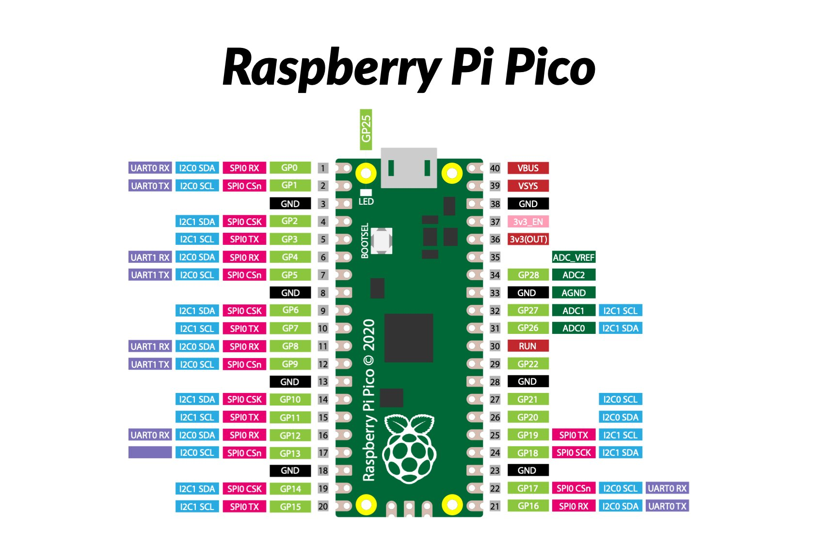

## Overview

Welcome to Lesson 2 of the `Raspberry Pi Pico with MicroPython - GPIO Mastery` course. In this lesson, we will discuss the Raspberry Pi Pico's pin numbering system and the role of each pin.

---

## Course Content

In this lesson, you will learn:

* The Raspberry Pi Pico's pin numbering system
* The role of each pin and how to identify them

---

The Raspberry Pi Pico has several types of GPIO pins, including digital I/O, PWM, ADC, I2C, and SPI pins. Each pin has a specific function and can be used to connect different electronic components to the board.

---

## Raspberry Pi Pico's Pin Numbering System

The GPIO pins on the Raspberry Pi Pico are numbered from 0 to 29. The pins are arranged in two rows on the board, with the odd-numbered pins on the left row and the even-numbered pins on the right row. The pins are numbered in a way that reflects their basic functions and groupings.

---

## Identifying Pins on the Raspberry Pi Pico

To identify the pins on the Raspberry Pi Pico, we can refer to the pinout diagram in the datasheet or on the board itself. The pinout diagram shows the function and number of each pin, as well as its physical location on the board.

{:class="img-fluid w-100"}

In addition, the Raspberry Pi Pico has labels on the board that indicate the function of each pin. For example, the pins labeled "GP0" to "GP28" are digital I/O pins, and the pins labeled "ADC0" to "ADC3" are ADC pins.

---

## Pinouts

| Pin Number | Type        | Capabilities                                        |
|------------|-------------|-----------------------------------------------------|
| GP0        | Digital I/O | General purpose I/O, can be used as input or output |
| GP1        | Digital I/O | General purpose I/O, can be used as input or output |
| GP2        | Digital I/O | General purpose I/O, can be used as input or output |
| GP3        | Digital I/O | General purpose I/O, can be used as input or output |
| GP4        | Digital I/O | General purpose I/O, can be used as input or output |
| GP5        | Digital I/O | General purpose I/O, can be used as input or output |
| GP6        | Digital I/O | General purpose I/O, can be used as input or output |
| GP7        | Digital I/O | General purpose I/O, can be used as input or output |
| GP8        | Digital I/O | General purpose I/O, can be used as input or output |
| GP9        | Digital I/O | General purpose I/O, can be used as input or output |
| GP10       | Digital I/O | General purpose I/O, can be used as input or output |
| GP11       | Digital I/O | General purpose I/O, can be used as input or output |
| GP12       | Digital I/O | General purpose I/O, can be used as input or output |
| GP13       | Digital I/O | General purpose I/O, can be used as input or output |
| GP14       | Digital I/O | General purpose I/O, can be used as input or output |
| GP15       | Digital I/O | General purpose I/O, can be used as input or output |
| GP16       | Digital I/O | General purpose I/O, can be used as input or output |
| GP17       | Digital I/O | General purpose I/O, can be used as input or output |
| GP18       | Digital I/O | General purpose I/O, can be used as input or output |
| GP19       | Digital I/O | General purpose I/O, can be used as input or output |
| GP20       | Digital I/O | General purpose I/O, can be used as input or output |
| GP21       | Digital I/O | General purpose I/O, can be used as input or output |
| GP22       | Digital I/O | General purpose I/O, can be used as input or output |
| GP26       | Digital I/O | General purpose I/O, can be used as input or output |
| GP27       | Digital I/O | General purpose I/O, can be used as input or output |
| GP28       | Digital I/O | General purpose I/O, can be used as input or output |
| GP29       | Digital I/O | General purpose I/O, can be used as input or output |
| GP14       | ADC         | Analog-to-digital converter input                   |
| GP15       | ADC         | Analog-to-digital converter input                   |
| GP16       | ADC         | Analog-to-digital converter input                   |
| GP17       | ADC         | Analog-to-digital converter input                   |
| GP18       | PWM         | Pulse-width modulation output                       |
| GP19       | PWM         | Pulse-width modulation output                       |
| GP20       | PWM         | Pulse-width modulation output                       |
{:class="table table-striped"}

---

## Key Results

After you have completed this lesson, you will be familiar with the Raspberry Pi Pico's pin numbering system. You will be able to identify and locate each pin, which will allow you to correctly connect components and devices to the appropriate pins in your projects.

---
