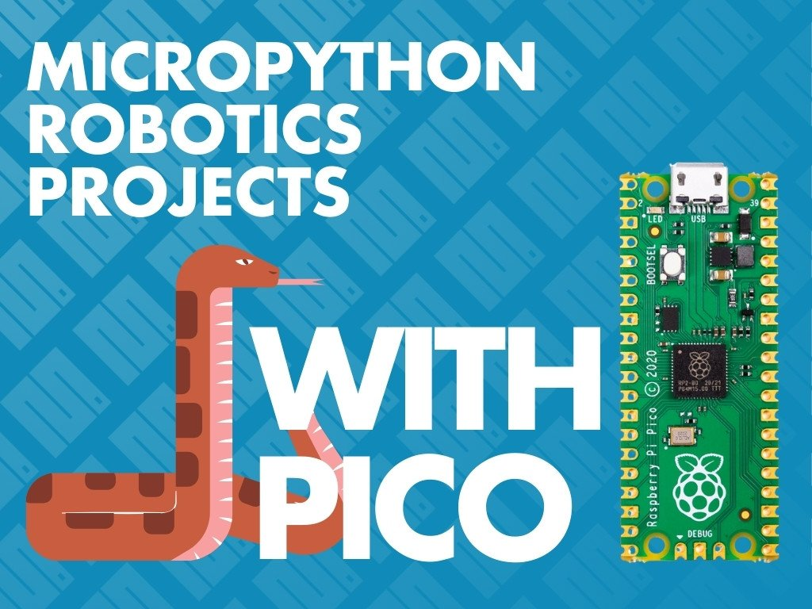

{:class="cover"}

---

Robots don’t have to be complicated — and with **MicroPython and the Raspberry Pi Pico**, you can build intelligent, moving robots using just a few components and a bit of code.

In this course, we’ll go beyond blinking LEDs and dive into the world of **motor control**, **sensor feedback**, and **robotic behavior**, all powered by Python.

---

## 🤖 What You’ll Learn

In this course, you’ll build your own simple, programmable robot and learn how to:

- Control DC motors using motor drivers
- Follow lines using IR sensors
- Avoid obstacles using ultrasonic sensors
- Use servos to scan the environment
- Build a two-wheeled robot chassis
- Add remote control with Bluetooth or Wi-Fi
- Write basic autonomous behaviors

---

## 🔧 What You’ll Need

To get the most out of this course, we recommend having:

- Raspberry Pi Pico or Pico W (for Wi-Fi control)
- L298N motor driver module
- 2x DC gear motors and wheels
- 1x ultrasonic sensor (e.g. HC-SR04)
- 1x IR line-following sensor or sensor array
- 1x servo motor (e.g. SG90)
- Battery holder or power supply
- Jumper wires and breadboard or soldered connections
- Optional: HC-05 Bluetooth module (for Bluetooth control)

If you’re using the **Pico W**, you’ll also need a 2.4GHz Wi-Fi network for wireless control.

---

## 🧠 Why Learn Robotics with MicroPython?

Learning robotics with MicroPython is a great way to:

- Combine coding with physical computing
- Explore automation and control systems
- Develop skills for more complex projects like autonomous rovers or IoT devices
- Build fun, hands-on projects that reinforce programming concepts

You’ll also get experience with real-world hardware components like sensors and motor drivers.

---

By the end of this course, you’ll have built your own functioning robot and programmed it to move, sense, and react to its environment.

Let’s get started!

Next up: [Controlling DC Motors](02_dc_motors)

---

