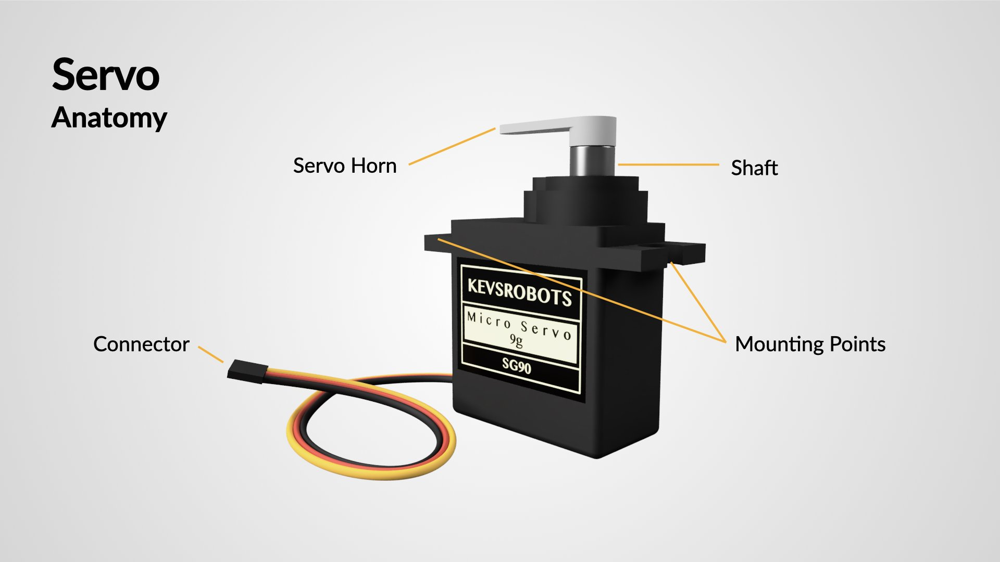
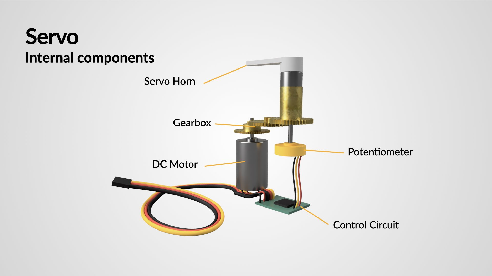
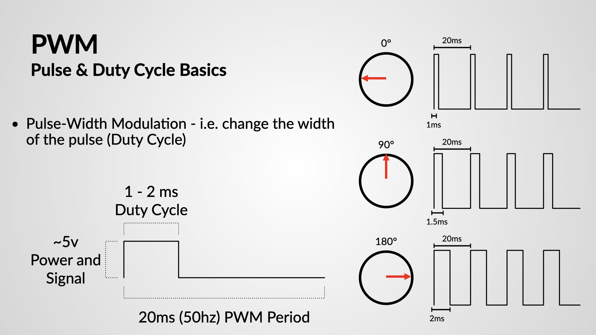

{:class="cover"}

---

With a fixed ultrasonic sensor, your robot can only detect what’s directly in front of it. By mounting the sensor on a **servo motor**, you can scan the surroundings and make smarter decisions based on a wider field of view.

---

## 🔄 How Servos Work

A servo motor rotates to a specific angle between 0° and 180°. You control it by sending **PWM signals** with specific duty cycles that correspond to different angles.

{:class="w-100 rounded-3"}

{:class="w-100 rounded-3"}

{:class="w-100 rounded-3"}

---

## 🔌 Wiring the Servo and Sensor

- **Servo**
  - Signal → GP10 (or any PWM-capable pin)
  - VCC → 5V
  - GND → GND

> ⚠️ Some servos draw a lot of current — consider powering them from the L298N 5V output or a separate regulator.

- **Ultrasonic sensor** remains wired to GP8 (TRIG) and GP9 (ECHO)

---

## 🧪 Basic Servo Test

```python
from machine import Pin, PWM
from time import sleep

servo = PWM(Pin(10))
servo.freq(50)

def set_angle(angle):
    duty = int(1638 + (angle / 180) * 4912)  # Convert 0–180° to duty cycle
    servo.duty_u16(duty)

# Sweep
while True:
    for angle in range(0, 181, 15):
        set_angle(angle)
        sleep(0.1)
    for angle in range(180, -1, -15):
        set_angle(angle)
        sleep(0.1)
🧠 Scanning with the Ultrasonic Sensor
Combine the servo sweep with distance measurement:

python
Copy
Edit
from machine import Pin, PWM, time_pulse_us
from time import sleep

servo = PWM(Pin(10))
servo.freq(50)

trigger = Pin(8, Pin.OUT)
echo = Pin(9, Pin.IN)

def set_angle(angle):
    duty = int(1638 + (angle / 180) * 4912)
    servo.duty_u16(duty)
    sleep(0.15)

def get_distance():
    trigger.low()
    sleep(0.002)
    trigger.high()
    sleep(0.01)
    trigger.low()
    duration = time_pulse_us(echo, 1, 30000)
    return duration / 58

# Scan and print distance at each angle
for angle in range(0, 181, 30):
    set_angle(angle)
    dist = get_distance()
    print(f"Angle: {angle}°, Distance: {dist:.1f} cm")
    sleep(0.2)
```

---

## 🤖 Applications

- Detect which direction has the most space
- Map simple environments

Choose direction to turn based on obstacle data

---

## 🧩 Try It Yourself

- Add left/right logic based on where the most space is
- Mount two IR sensors on a servo for sweeping ground detection
- Save data and plot a radar-style graph (if connected to a PC)

---

Now your robot can look around before moving — just like a cautious driver!

Next up: [Bluetooth Control with HC-05](bluetooth_control)

---
