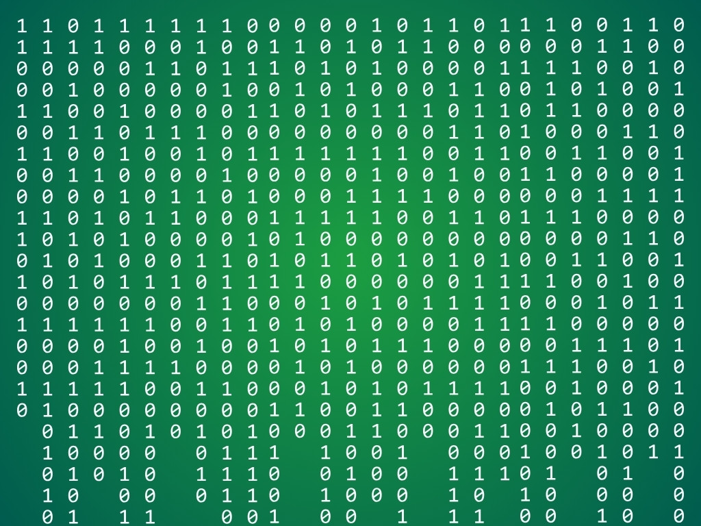

{:class="cover"}

---

You’ve learned how to control your robot manually. Now it’s time to **make it think for itself** — at least a little! In this lesson, you’ll combine your motor and sensor skills to create simple autonomous behavior.

---

## 🤔 What Is Autonomous Behavior?

Autonomous robots make decisions based on sensor data instead of waiting for human input. This can be as simple as:

- Avoiding obstacles
- Following a line
- Choosing the clearest path

We’ll build a basic robot that explores its environment and avoids crashing into things.

---

## 🧠 Basic Decision-Making Logic

Here’s a simple behavior loop:

1. **Move forward**
2. **Check for obstacle**  
   - If detected, stop
   - Scan left and right
   - Turn in the direction with more space
3. Repeat

---

## 🧪 Example: Obstacle-Avoiding Explorer

This example assumes:

- A forward-facing ultrasonic sensor
- Motors controlled with `forward()`, `backward()`, `left()`, `right()`, `stop()`
- Optional: sensor mounted on a servo for scanning

```python
from time import sleep
from machine import Pin, time_pulse_us, PWM

# Set up motors and ultrasonic sensor
# (use previous lessons for wiring and functions)

def get_distance():
    # Trigger pulse and measure response
    trigger.low()
    sleep(0.002)
    trigger.high()
    sleep(0.01)
    trigger.low()
    duration = time_pulse_us(echo, 1, 30000)
    return duration / 58

def explore():
    while True:
        distance = get_distance()
        print("Distance:", distance)

        if distance > 20:
            forward()
        else:
            stop()
            backward()
            sleep(0.5)
            stop()
            right()
            sleep(0.5)
            stop()

        sleep(0.1)

# Run the loop
explore()
```

---

## 💡 Optional: Scan for Best Direction

If your sensor is on a servo, sweep left and right, then turn toward the direction with more space:

```python
def scan_and_choose():
    set_angle(45)
    left_dist = get_distance()
    set_angle(135)
    right_dist = get_distance()
    set_angle(90)  # Reset forward

    if right_dist > left_dist:
        right()
    else:
        left()
```

---

## 🧩 Try It Yourself

- Add timed turns for corners
- Combine line following and obstacle avoidance
- Add randomness to movement direction for exploration

---

With autonomous behavior, your robot can now explore without constant input — a major milestone in robotics!

Next up: [Final Project – Build Your Own Robot](11_final_project)

---
