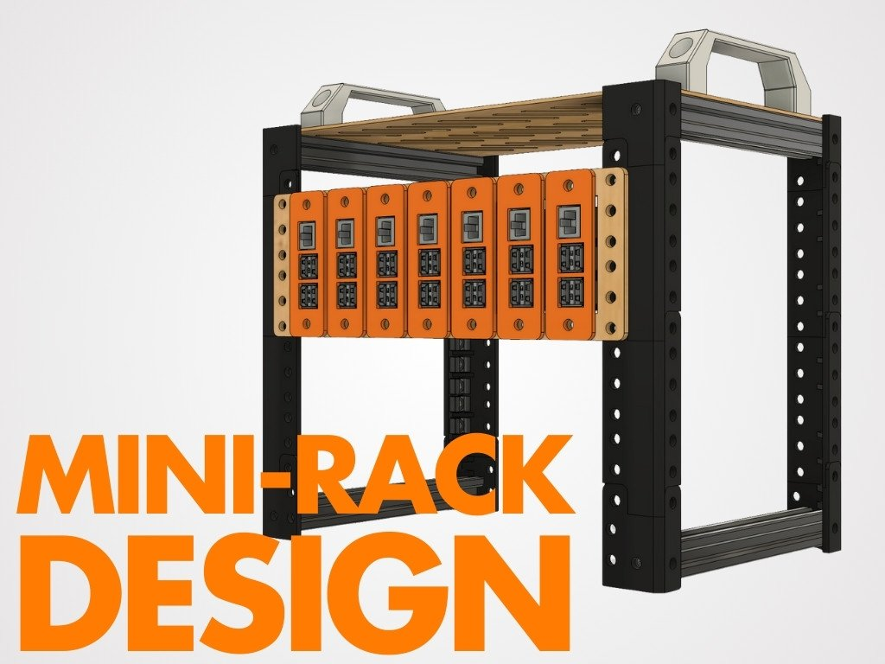
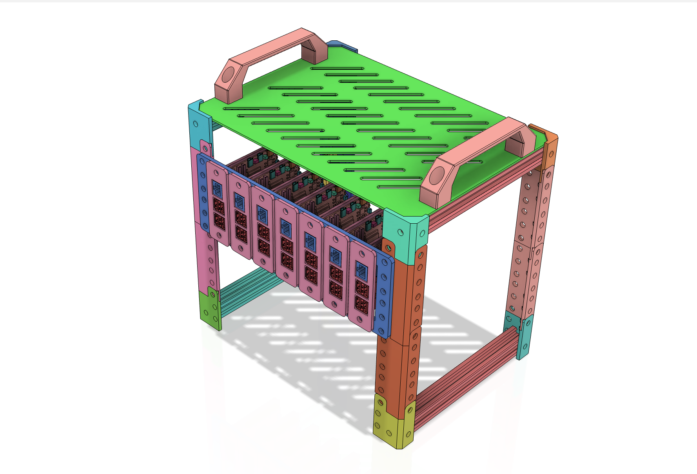

{:class="cover"}

Learn how to design and build your own 10" mini-rack for your Raspberry Pi cluster or home lab. This project is perfect for upgrading your home lab and keeping your equipment organized and easily accessible.

---

## What is a Mini-Rack?

A Mini-Rack is a small, 10" rack that can hold network equipment, computers and other related equipment. A full size rack, one you typically find in a server room or data center are 19" wide. A mini-rack is 10" wide, and designed for smaller spaces, perfect for a home lab or small office.

{:class="img-fluid w-100"}

---

## Why a Mini-Rack?

A mini-rack is a great way to keep your equipment organized and easily accessible. It keeps cables tidy and everything neat and in its place. It also helps with cooling, as the equipment is mounted in a way that allows for better airflow.

---
