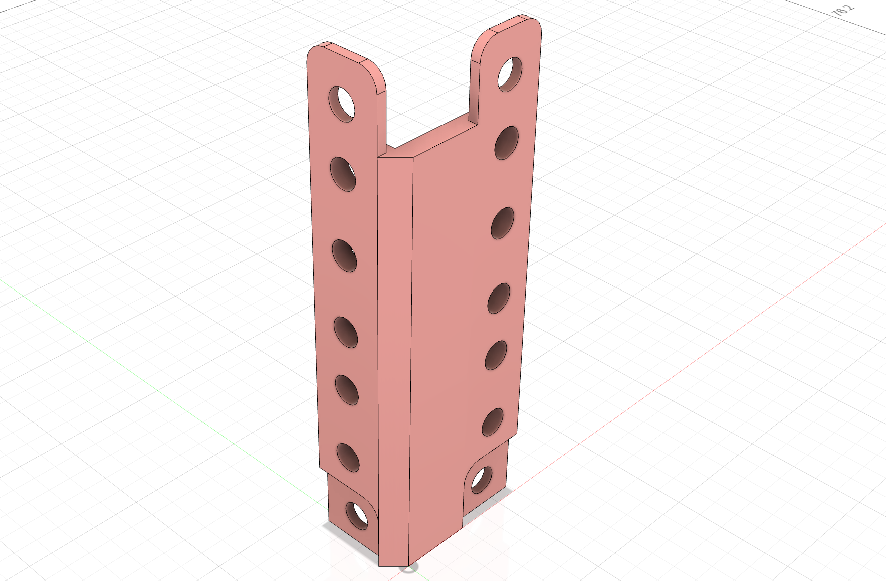

In this lesson we'll create the 2U corner piece for the mini-rack.

> ## What is a U?
>
> In rack units, 1U equals 1.75 inches (44.45 mm). The standard rack unit is a 19-inch (482.6 mm) wide horizontal space. This is the standard width of rack-mountable equipment. The height of a rack is measured in U. A U is 1.75 inches. A 1U rack is 1.75 inches tall, a 2U rack is 3.5 inches tall, and so on.

---

## Common Rack Dimensions

There are a number of key dimenions that are common to this design (and racks in general):

- 6M Holes: `6mm`
- Pitch between 1U holes - `15.875mm`
- 1U Height - `44.5mm` (you can use the `44.45mm` here instead)
- pitch between U's - `12.75mm`

---

## 2U Corner

{:class="img-fluid w-100"}

1. Create a new file named 2u_corner in Fusion 360
1. Create a new sketch on the XY plane, named `2u_base`

1. Create the following sketch:

    {:class="img-fluid w-100"}

1. Extrude the body profile by `4mm`:

    {:class="img-fluid w-100"}

1. Extrude the top tab profile by `2mm`:

    {:class="img-fluid w-100"}

1. Extrude-cut the bottom tab profile by `2mm`:

    {:class="img-fluid w-100"}

1. Create a new sketch on the top of the new part, named `top_profile`

1. Create the following sketch:

    {:class="img-fluid w-100"}

1. Extrude the top profile to the bottom surface of the main part:
    
    {:class="img-fluid w-100"}

1. Create a new sketch on the top of the body, named `Ribs`

1. Create the following sketch:

    {:class="img-fluid w-100"}

1. Create the following sketch on the left side of the main part:

    {:class="img-fluid w-100"}

1. Extrude-cut the last sketch:

    {:class="img-fluid w-100"}

1. Create the following sketch on the left side of the main part, for the top and bottom tabs:

    {:class="img-fluid w-100"}

1. Extrude-cut the last sketch:

    {:class="img-fluid w-100"}

1. Extrude-cut the last sketch:

    {:class="img-fluid w-100"}

1. Create cons construction plans for each rib:

1. Create a new consuction plane `14mm` from the top:

    {:class="img-fluid w-100"}

1. Create a new consuction plane `15.875mm` from the last construction plane:

    {:class="img-fluid w-100"}

1. Create a new consuction plane `14.5mm` from the last construction plane:

    {:class="img-fluid w-100"}

1. Create another new consuction plane `14.5mm` from the last construction plane:

    {:class="img-fluid w-100"}

1. Extrude the Rib profile created in step 11 to the construction planes just created, Set the start to the construction plane object, set the direction to `symmetric` the measurement to between, and the distance to `3mm`:

    {:class="img-fluid w-100"}

1. Extrude another rib profile to the next construction plane:

    {:class="img-fluid w-100"}

1. Extrude another rib profile to the next construction plane:

    {:class="img-fluid w-100"}

1. Extrude another rib profile to the next construction plane:

    {:class="img-fluid w-100"}

---
