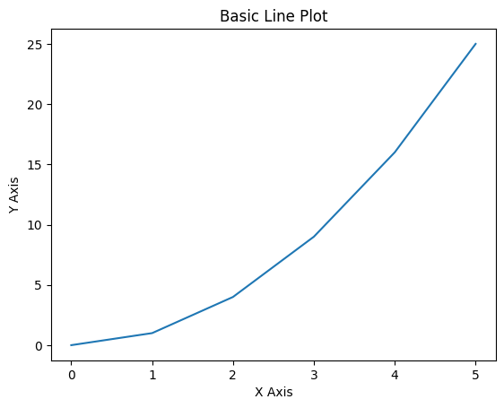
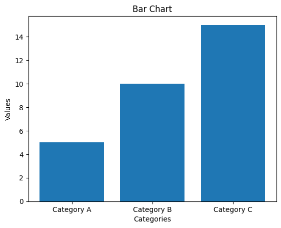
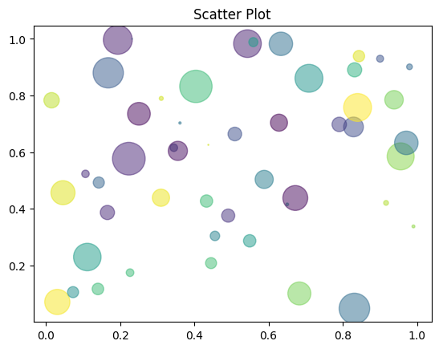
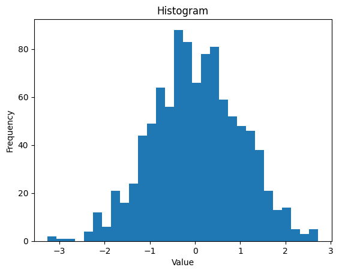
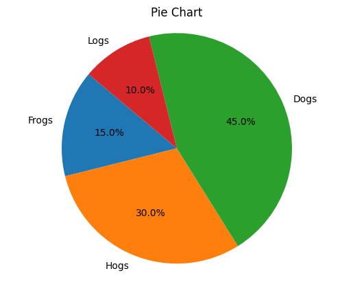

{:class="cover"}

## Overview

In this lesson, we focus on Visualization with Pandas and Matplotlib. Effective data visualization is crucial for interpreting and communicating data insights. We'll explore how Pandas integrates with Matplotlib to create a variety of charts and graphs for effective data presentation.

## Introduction to Matplotlib

`Matplotlib` is a comprehensive library for creating static, animated, and interactive visualizations in Python. Pandas data structures integrate well with Matplotlib.

## Basic Plotting with Pandas

Pandas DataFrames and Series have a `.plot()` method, which is a wrapper around Matplotlib's functionality:

```python
# Basic line plot
df['ColumnName'].plot()

# Basic histogram
df['ColumnName'].plot.hist()
```

## Customizing Plots

You can customize plots with various parameters:

```python
# Customized plot
df.plot(kind='bar', title='Bar Chart', legend=True, fontsize=12)
```

## Plotting Multiple Columns

Compare multiple columns in a single plot:

```python
# Plotting multiple columns
df[['Column1', 'Column2']].plot(kind='bar')
```

## Time Series Plotting

Time series data can be visualized effectively:

```python
# Time series plot
time_series_df.plot()
```

## Advanced Plots with Matplotlib

For more advanced plots, directly use Matplotlib:

```python
import matplotlib.pyplot as plt

# Scatter plot with Matplotlib
plt.scatter(df['Column1'], df['Column2'])
plt.title('Scatter Plot')
plt.xlabel('Column 1')
plt.ylabel('Column 2')
plt.show()
```

---

## Some more exmaples

Matplotlib is a versatile plotting library in Python, widely used for creating static, interactive, and animated visualizations. Here are a few examples to showcase its capabilities:

### 1. Basic Line Plot

```python
import matplotlib.pyplot as plt

x = [0, 1, 2, 3, 4, 5]
y = [0, 1, 4, 9, 16, 25]

plt.plot(x, y)
plt.title('Basic Line Plot')
plt.xlabel('X Axis')
plt.ylabel('Y Axis')
plt.show()
```

This code produces a simple line plot, plotting `x` versus `y`.

{:class="img-fluid w-50 shadow-lg"}

---

### 2. Bar Chart

```python
categories = ['Category A', 'Category B', 'Category C']
values = [5, 10, 15]

plt.bar(categories, values)
plt.title('Bar Chart')
plt.xlabel('Categories')
plt.ylabel('Values')
plt.show()
```

This creates a bar chart displaying the values of different categories.

{:class="img-fluid w-50 shadow-lg"}

---

### 3. Scatter Plot

```python
import numpy as np

x = np.random.rand(50)
y = np.random.rand(50)
colors = np.random.rand(50)
area = (30 * np.random.rand(50))**2

plt.scatter(x, y, s=area, c=colors, alpha=0.5)
plt.title('Scatter Plot')
plt.show()
```

This scatter plot uses random data, with varying sizes and colors for the points.

{:class="img-fluid w-50 shadow-lg"}

---

### 4. Histogram

```python
data = np.random.normal(0, 1, 1000)

plt.hist(data, bins=30)
plt.title('Histogram')
plt.xlabel('Value')
plt.ylabel('Frequency')
plt.show()
```

This code generates a histogram of normally distributed data.

{:class="img-fluid w-50 shadow-lg"}

---

### 5. Pie Chart

```python
sizes = [15, 30, 45, 10]
labels = ['Frogs', 'Hogs', 'Dogs', 'Logs']

plt.pie(sizes, labels=labels, autopct='%1.1f%%', startangle=140)
plt.axis('equal')
plt.title('Pie Chart')
plt.show()
```

This creates a pie chart showing the relative sizes of different items.

{:class="img-fluid w-50 shadow-lg"}

---

## Summary

This lesson introduced you to the basics of visualization with Pandas and Matplotlib. From simple line charts to more complex scatter plots, you now have the tools to visualize and communicate your data effectively.

---
