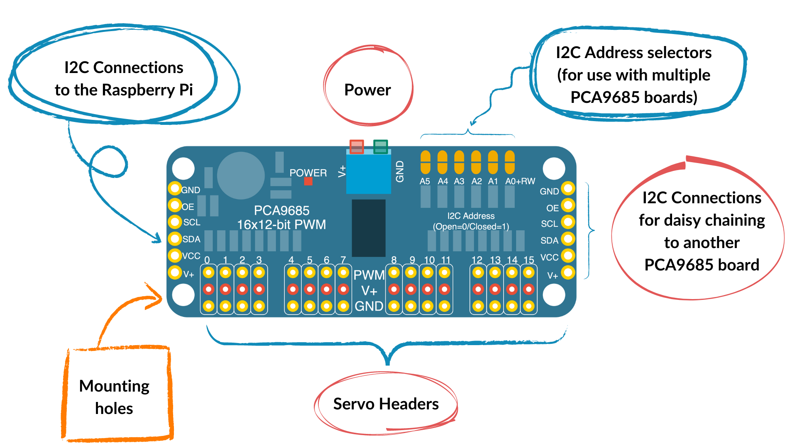
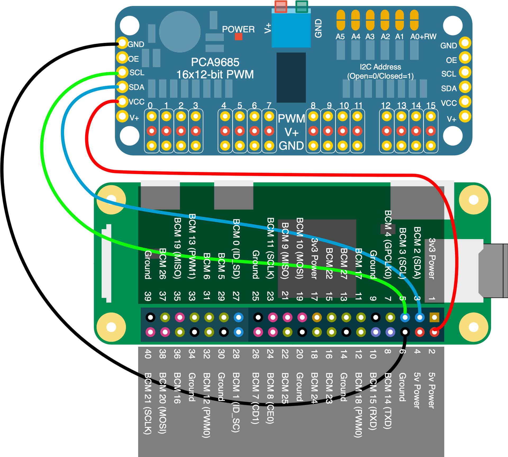

{:class="cover"}

## Understanding the PCA9685 Servo Driver

{:class="w-100 img-fluid"}

The [PCA9685](https://www.adafruit.com/search?q=pca9685) servo driver is an essential component in robotics for controlling multiple servos simultaneously. It's a 16-channel, 12-bit PWM (Pulse Width Modulation) controller with an I2C interface, making it perfect for projects like our robot arm, where precise movement and control of several servos are required.

---

## Why Use PCA9685?

- **Multiple Servos:** Control up to 16 servos with just two pins from your Raspberry Pi.
- **Precision:** Offers 12-bit resolution for smooth and precise servo movements.
- **I2C Interface:** Uses the I2C bus, saving valuable GPIO pins for other sensors or components.

---

## Key Features of PCA9685

- **16 Channels:** Can control up to 16 servos or LEDs.
- **Adjustable Frequency:** PWM frequency is adjustable from about 24Hz to 1526Hz.
- **External Power Supply:** Can be powered by an external source to drive larger servos.
- **Chainable Design:** Multiple PCA9685 boards can be chained together to control even more servos.

---

## Connecting PCA9685 to Raspberry Pi

To control servos with the PCA9685 using your Raspberry Pi, you'll need to make the following connections:

1. **VCC** to Raspberry Pi 5V
2. **GND** to Raspberry Pi GND
3. **SCL** to Raspberry Pi SCL (GPIO 3)
4. **SDA** to Raspberry Pi SDA (GPIO 2)

Additionally, you'll connect an external power supply to the PCA9685 to power the servos, ensuring to share a common ground with the Raspberry Pi.

---

## Basic Circuit Diagram

{:class="img-fluid w-50"}

Here's a simple diagram showing how to connect the PCA9685 to the Raspberry Pi and servos:

```plaintext
[PCA9685]        [Raspberry Pi]
VCC -----------> 5V
GND -----------> GND
SCL -----------> GPIO 3 (SCL)
SDA -----------> GPIO 2 (SDA)

[External Power Supply]
+ (5-6V) -----> V+ (on PCA9685)
- ------------> GND (shared with Raspberry Pi)
```

---

## Initializing the PCA9685 with Python

Before we can control the servos, we need to initialize the PCA9685 board using Python. Here's how to do it using the Adafruit PCA9685 library:

```python
from Adafruit_PCA9685 import PCA9685

# Initialize the PCA9685 using the default address (0x40).
pwm = PCA9685()

# Set the PWM frequency to 60Hz, good for servos.
pwm.set_pwm_freq(60)
```

---

## Conclusion

You now understand what the PCA9685 servo driver is, why it's beneficial for robotics projects, and how to connect it to your Raspberry Pi. In the next lesson, we'll delve into how to program the Raspberry Pi to control the servos connected to the PCA9685 for precise movements of your robot arm.

---

## Lesson Assignment

Review the connections between the Raspberry Pi and the PCA9685 and set up a basic circuit as described. Ensure your setup is ready for the next lesson, where we will start programming movements.

---
