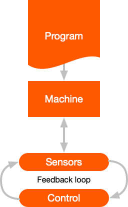

> *"A Robot is a machine, especially one programmable by a computer, capable of carrying out a  complex series of actions automatically.*
> *Robots can be guided by an external control device or the control may be embedded within."*

## But what does this mean?

To understand that definition we need to look at the different parts of a robot:

* **Program** - A list of instructions for the machine - the complex series of actions
* **Machine** - The machine that processes the program and links to inputs - sensors, and outputs - controls
* **Sensors** - take measurements and provide readings to the machine
* **Controls** - moving parts that can be set by the machine

---
