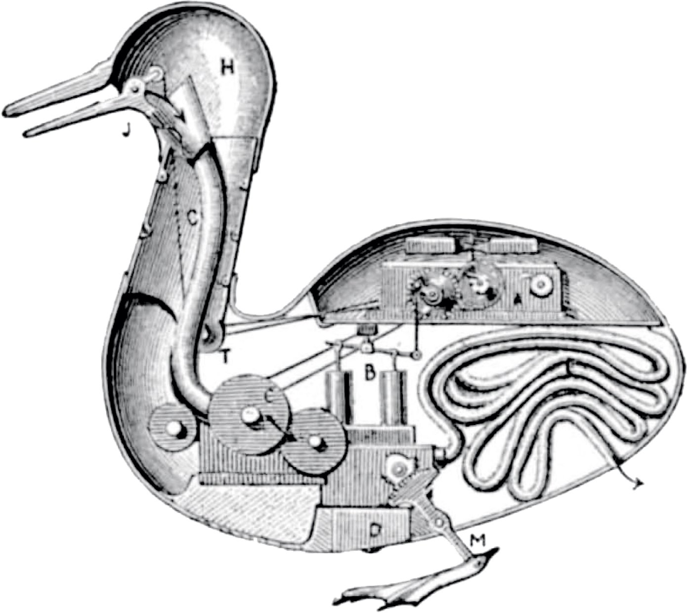
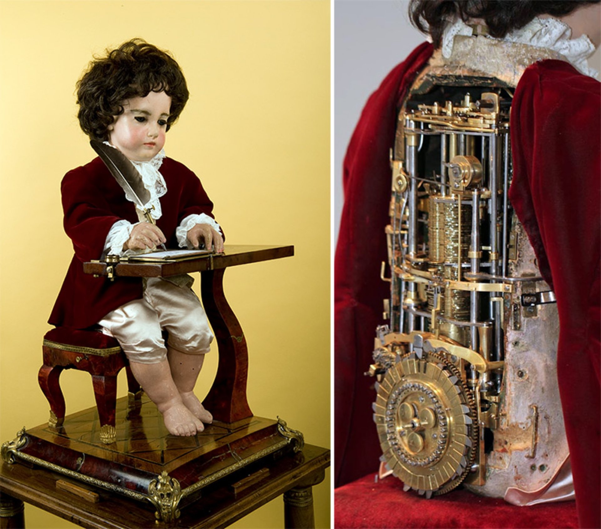

{:class="cover"}

## Contents

- [The term Robot](#the-term-robot)
- [Father of Robotics](#father-of-robotics)
- [Historic Robots](#historic-robots)
- [Early Robots](#early-robots)
- [Modern Robots](#modern-robots)
- [The term Robotics](#robotics)

---

## The term Robot

> *'Robot' was first applied as a term for artificial automata in the 1920 play R.U.R. by the Czech writer*

[{:class="img-fluid w-25"}](assets/josef_capek.jpg)

However, **Josef Čapek** was named by his brother Karel as the true inventor of the term robot.

The word 'robot' itself was not new, having been in the Slavic language as robota (forced labor), a term applied to peasants obligated to compulsory service under the feudal system.

Čapek's fictional story postulated the technological creation of artificial human bodies without souls, and the old theme of the feudal robota class eloquently fit the imagination of a new class of manufactured, artificial workers.

---

## Father of Robotics

Ismail al-Jazari, 12 Century

*“...is quite likely that it was an early programmable automata. It has a programmable drum machine with pegs (cams) that bump into little levers that operated the percussion.”*

---

The hand-washing automaton with a flush mechanism designed by al-Jazari.

[{:class="img-fluid w-25"}](assets/hand_washing.jpg)

---

A Musical Toy from a copy of al-Jazari's treatise on automata, Kitab fi ma'ari-fat al-hiyal al-handasiya (1206 C.E.) Early 14th century (1315).

[{:class="img-fluid w-50"}](assets/muscial_toy.jpg)

---

## Historic Robots

**Also known as Automatons** - From the greek neuter ‘acting of one’s own will’.

### The Duck of Vaucanson

A postulated interior of the Duck of Vaucanson (1738-1739) [^1].

[{:class="img-fluid w-50"}](assets/duck.jpg)

---

### Rama

Automaton in the Swiss Museum CIMA [^2].

[{:class="img-fluid w-25"}](assets/rama.jpg)

---

### The Writer

One of the first programmable robots [^3]. The Writer was built in the 1770s using 6,000 moving parts by Pierre Jaquet-Droz, his son Henri-Louis, and Jean-Frédéric Leschot.

[{:class="img-fluid w-50"}](assets/the_writer.jpg)

---

## Early Robots

**Often little more than curiosities and show pieces**

### George & Eric

In 1928, one of the first humanoid robots ‘Eric’ (brother to George) was exhibited at the annual exhibition of Model Engineers Society in London.

W. H. Richards with "George", 1932 [^4]

[{:class="img-fluid w-25"}](assets/george.jpg)

---

## Elektro

Elektro the Moto-Man and his Little Dog Sparko. [^5]

Created by Westinghouse Electric Company for the 1939 World's Fair.
He could:

- walk by voice command
- speak about 700 words (using a 78-rpm record player)
- smoke cigarettes
- blow up balloons
- and move his head and arms.

Elektro's body consisted of a steel gear, cam and motor skeleton covered by an aluminum skin. His photoelectric "eyes" could distinguish red and green light.
Pictured here with Sparko

[{:class="img-fluid w-25"}](assets/elektro.jpg)

---

## Modern Robots

### Some examples of robots from today

- **Industrial** - Manufacturing, packaging, distribution, production
- **Educational** - Lego Mind-storms
- **Entertainment** - Movies, Short-Circuit, Star Wars, iRobot
- **Healthcare** - prosthetic limbs
- **Military** - Drones, bomb-disposal, Satellite positioning and surveillance

### Domestic

- **Cleaning Robots** - Roomba
- **Toys** - Furby
- **Self driving vehicles** - Tesla
- **Assistants** - AIBO

---

## Androids & Non-humanoid Robots

**Android robots look like humans, Non-humanoid robots can be any shape**

### K.I.T.T.

K.I.T.T. (Knight Industries Two Thousand) - a fictional non-humanoid robot [^6]

[{:class="img-fluid w-50"}](assets/kitt.jpg)

---

### EveR-2

EveR-2, the first android that has the ability to sing [^7]

[{:class="img-fluid w-25"}](assets/ever2.jpg)

---

## Robotics

The term was coined by Isaac Asimov in 1941.

[{:class="img-fluid w-25"}](assets/isaac_asimov.jpg)

The three laws of Robotics:

1. First Law
A robot may not injure a human being or, through inaction, allow a human being to come to harm.
2. Second Law
A robot must obey the orders given it by human beings except where such orders would conflict with the First Law.
3. Third Law
A robot must protect its own existence as long as such protection does not conflict with the First or Second Law.

*Isaac Asimov, 1942 from the short story "Runaround"*

---

## Footnotes

[^1]: By A. Konby (?) - Internet Archive, Public Domain, https://commons.wikimedia.org/w/index.php?curid=793187
[^2]: By Rama - Own work, CC BY-SA 2.0 fr, https://commons.wikimedia.org/w/index.php?curid=2839956
[^3]: https://www.thisiscolossal.com/2013/11/the-writer-automata/
[^4]: By Bundesarchiv, Bild 102-13018 / CC-BY-SA 3.0, CC BY-SA 3.0 de, https://commons.wikimedia.org/w/index.php?curid=5480820
[^5]: Exhibit in the Senator John Heinz History Center, 1212 Smallman Street, Pittsburgh, Pennsylvania, USA. There were no restrictions on photography in the museum collections.
[^6]: By K.I.T.T.1982 - +EST Co.,LTD. Universal Studios LLLP., CC BY-SA 3.0, https://commons.wikimedia.org/w/index.php?curid=3505085
[^7]: By Korea Institute of Industrial Technology (한국생산기술연구원) - http://news.naver.com/main/read.nhn?mode=LSD&amp;mid=sec&amp;sid1=102&amp;oid=020&amp;aid=0000371339, Attribution, https://commons.wikimedia.org/w/index.php?curid=4362293

---
