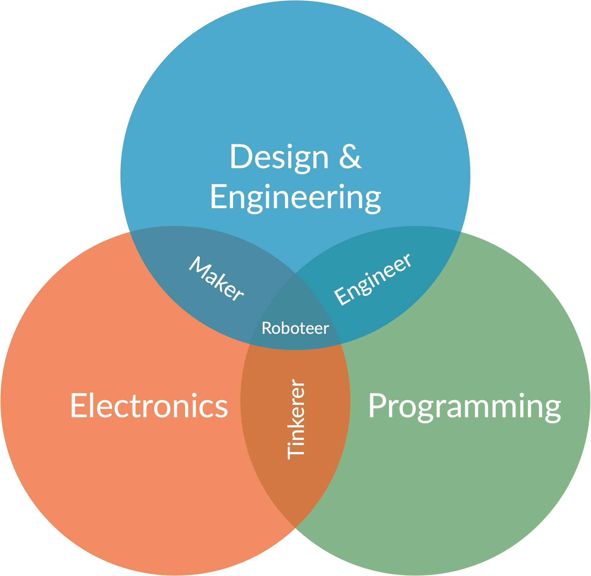
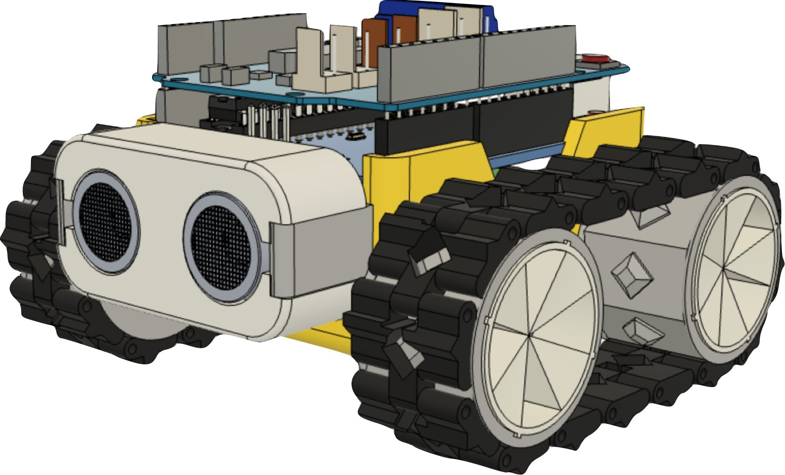
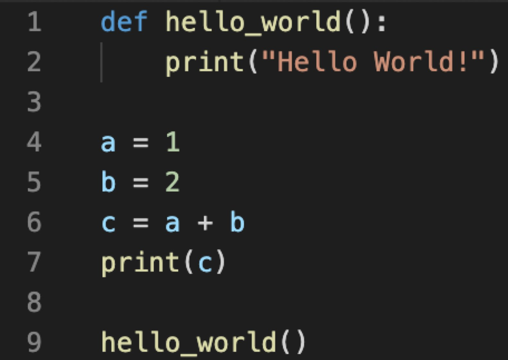

{:class="img-fluid w-50"}

[**Design**](#design--engineering) - Making the physical robot

[**Programming**](#programming) - Writing the code to control the robot

[**Electronics**](#electronics) - Send and receive signals to the sensors and motors 

---

## Design & Engineering

How to build a robot.

Building a robot requires:

- A design or blueprint
- Practical skills
- Materials & parts - wheels, filament, glue, 
- Tools & Machinery, a 3d printer
- Time, Patience and practice

SMARS is a 3d Printed Robot, the designs can be found at:
<https://www.smarsfan.com>

{:class="img-fluid w-25"}

---

## Programming

**What is a program?**

- A program is a list of human-readable instructions for the computer to carry out
- A program is written in a computer language, such as Python, Javascript, C++
- Programs can also constructed visually, using blocks in software such as Scratch

An example program, written in Python:

{:class="img-fluid w-25"}

---

## Electronics

How to wire up a robot
Electronics skills & Knowledge:

- How a circuit works
- Voltage, Current, Resistance
- Common components
- Batteries
- Connectors
- Protocols such as I2C, SPI, UART

SMARS uses off-the-shelf components, so is easy to wire up

{:class="img-fluid w-25"}

---
