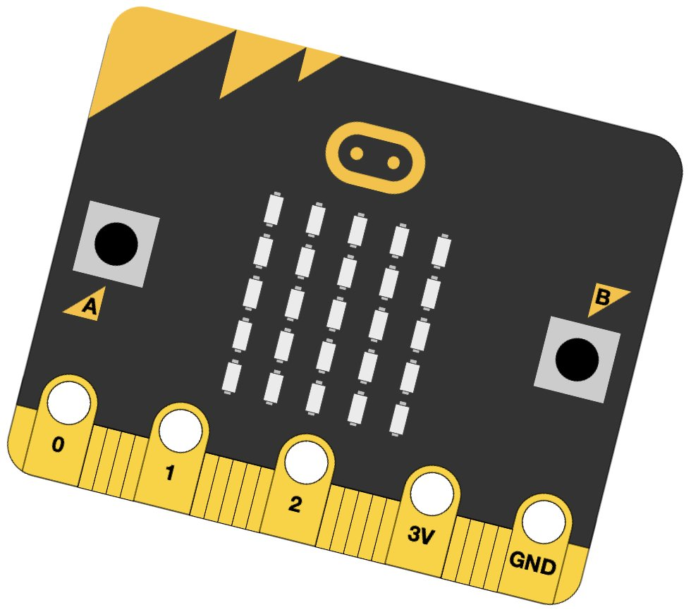

## Video

This video explains what a robot is, and the examples of early robots.



---

## The robot Brain

- Most robots have a computer or micro-controller to perform the instructions from the program
- The ‘brain’ could just be a simple circuit, without a central processing unit (CPU)
- Common microcontrollers include:

  - BBC micro:bit
  - Raspberry Pi Pico
  - Arduino Uno
  - NodeMCU (ESP8266)

A BBC micro:bit; Visit <https://www.microbit.org> for more about this amazing device.

[{:class="img-fluid w-25"}](https://www.microbit.org)

---
