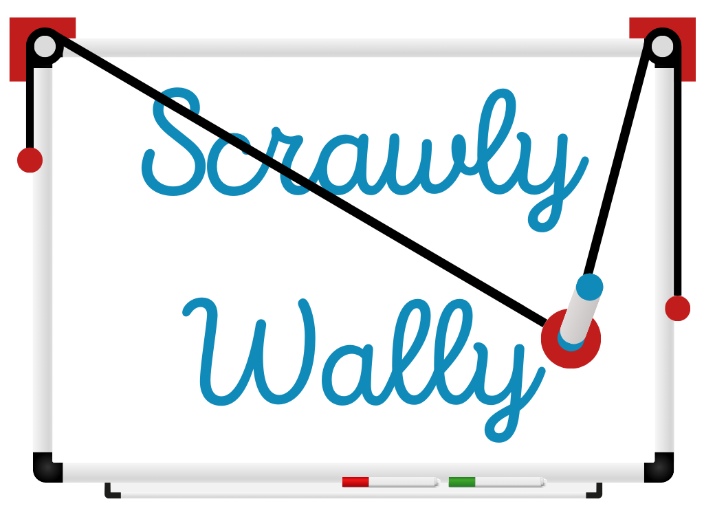

{:class="cover"}

---

## Introduction

Welcome to the Wall Drawing Robot tutorial! In this course, you'll learn how to build a robot that can draw on a wall using a Raspberry Pi Zero 2 W, stepper motors, and a gondola with a marker. The robot will be able to create intricate drawings by controlling the movement of the gondola across the wall.

---

## Course Overview

This course will guide you through the following steps:
1. Understanding the components needed for the robot.
2. Assembling the robot and wiring the components.
3. Setting up the Raspberry Pi and installing the necessary software.
4. Writing Python code to control the robot.
5. Drawing your first design and exploring advanced features.

---

Let's get started!

---
