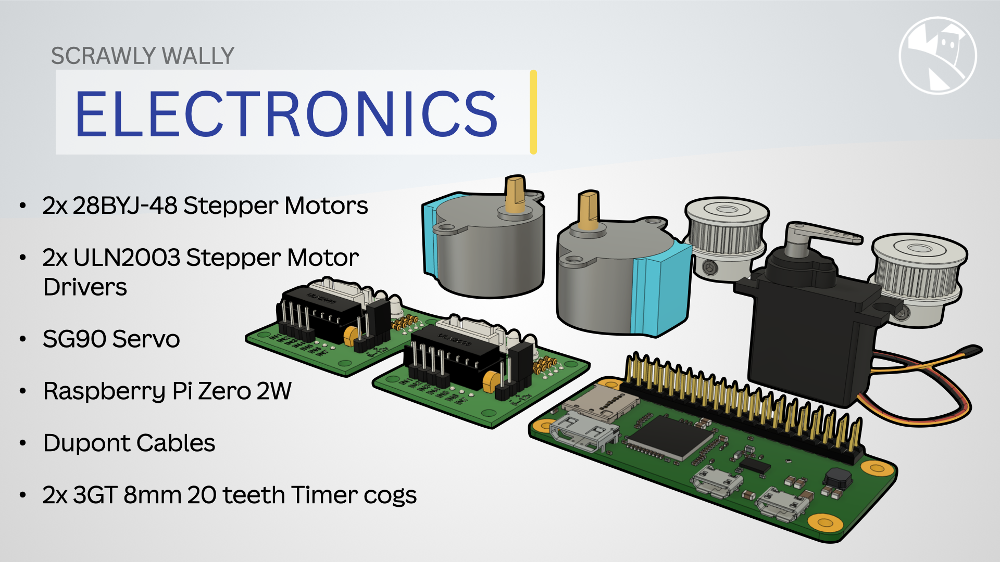
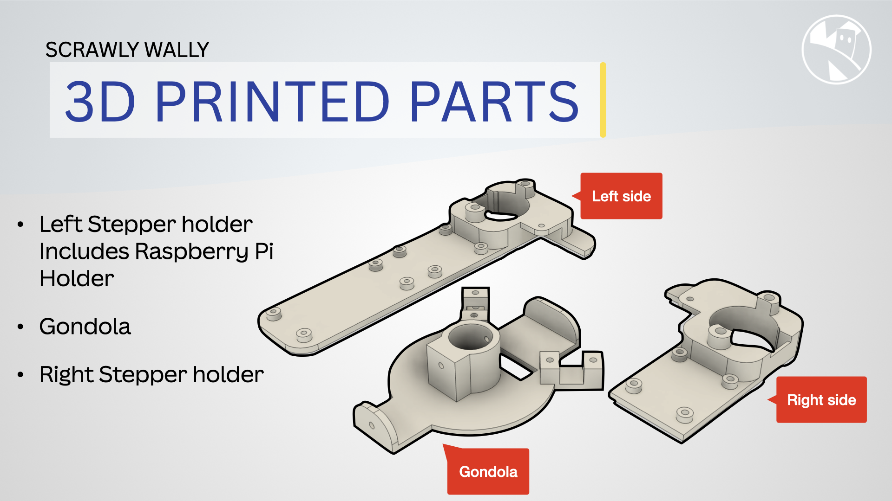

{:class="cover"}

---

## Components

To build the wall drawing robot, you'll need the following components:

Item                         | Description                         | Quantity | Price | Total
-----------------------------|-------------------------------------|----------|-------|------
Raspberry Pi Zero 2 W        | Single-board computer               | 1        | $15   | $15
28BYJ-48 Stepper Motor       | Stepper motor for precise control   | 2        | $5    | $10
ULN2003 Stepper Motor Driver | Driver board for the stepper motors | 2        | $2    | $4
Gondola                      | Platform for the marker pen         | 1        | $0    | $0
Marker Pen                   | Pen for drawing on the wall         | 1        | $1    | $1
Micro Servo Motor            | Motor for controlling the pen       | 1        | $3    | $3
Toothed Pulley String        | String for moving the gondola       | 1        | $2    | $2
Power Supply                 | Power source for Raspberry Pi       | 1        | $10   | $10
DuPont Jumper Wires          | Wires for connecting components     | 1 pack   | $5    | $5
Mounting Hardware            | Screws, brackets, etc.              | -        | $5    | $5
3GT 20 Teeth Timer Cog       | Timing belt pulley                  | 1        | $2    | $2
{:class="table table-striped"}

---

{:class="w-100 rounded-3 card-shadow card-hover"}

---

## 3D Printed Parts

{:class="w-100 rounded-3 card-shadow card-hover"}

The following 3D printed parts are needed for the wall drawing robot:

- [`gondola.stl`](assets/gondola.stl) Gondola
- [`left_side.stl`](assets/left_side.stl) Left side motor mount
- [`right_side.stl`](assets/right_side.stl) Right side motor mount

---

Make sure you have all the components before proceeding to the next step.

---
