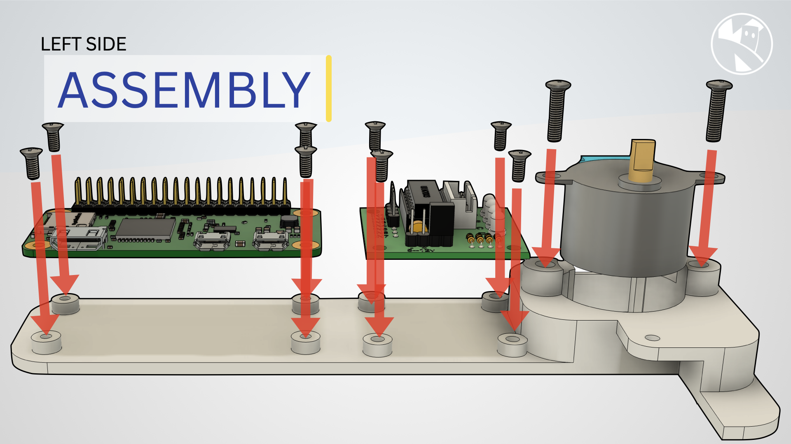
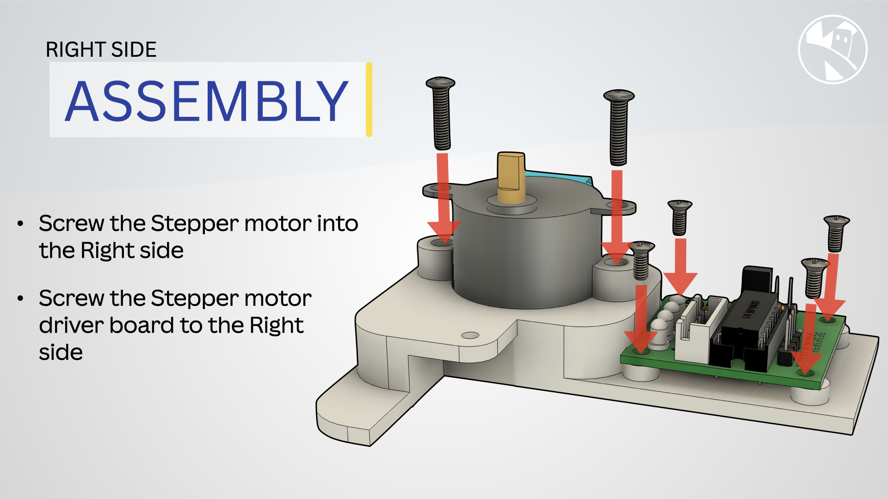
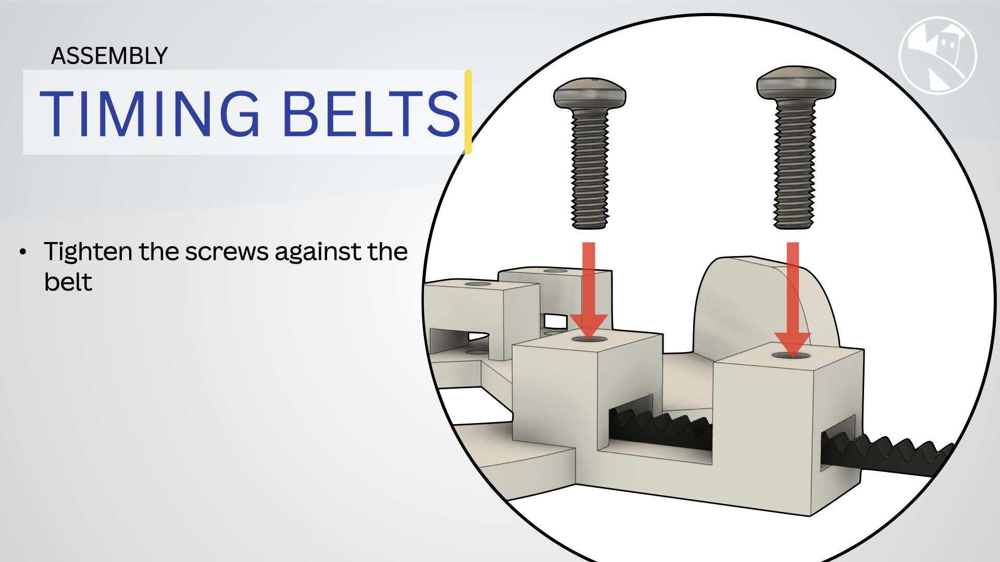
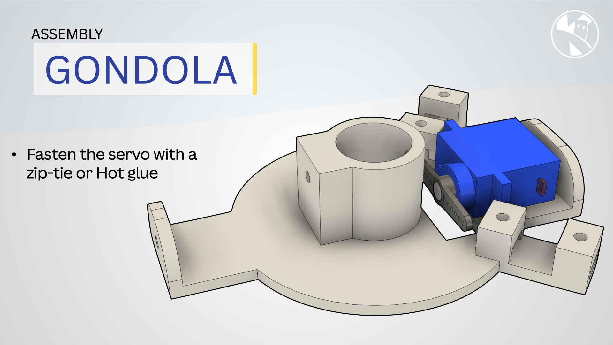
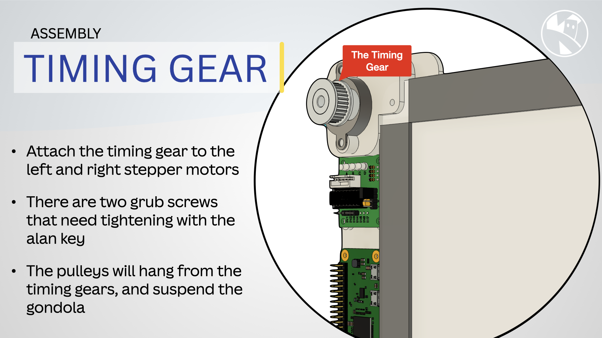
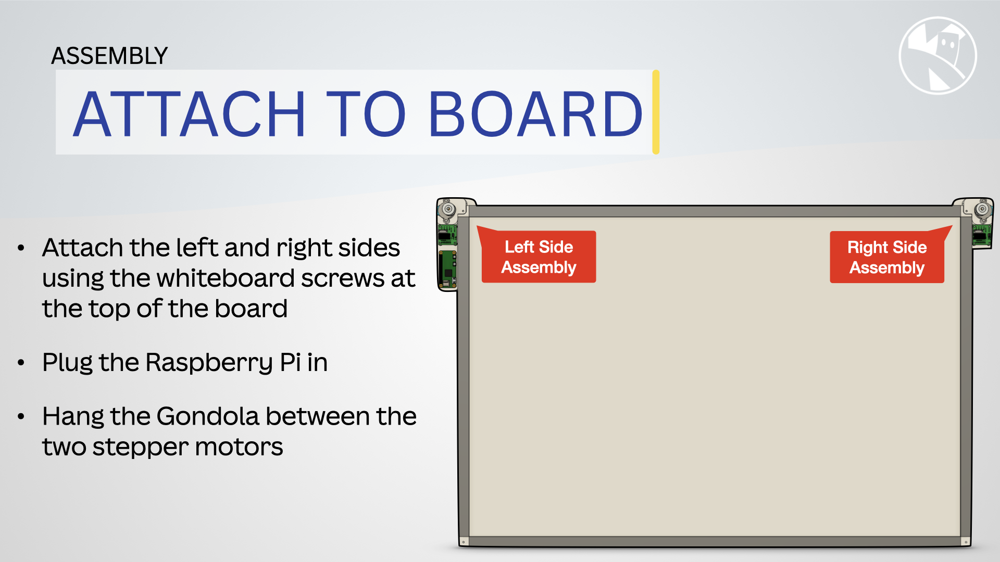
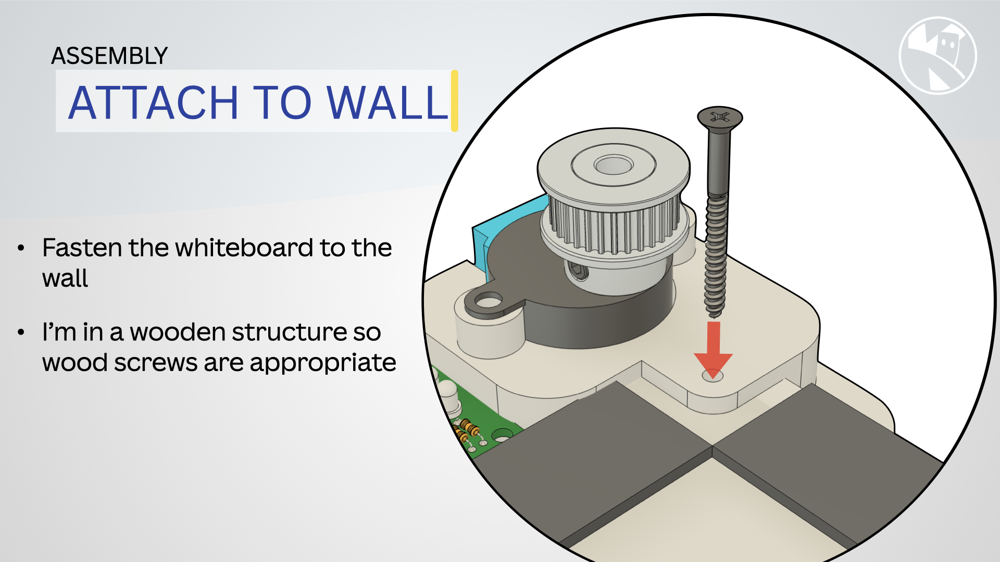

{:class="cover"}

---

## Assembly

Follow the instructions below to assemble the wall drawing robot parts:

Item | Action
--- | ---
**Mount the Stepper Motors**: Secure the stepper motors with two screws to the left side and right sides 3D printed parts.    **Mount the Raspberry Pi Zero 2 W**: Attach the Raspberry Pi to the top of the left side motor mount using M2.5 screws.   **Plug the Stepper Motors**: Connect the stepper motors to the driver boards using connector. | {:class="w-100 img-fluid rounded-3 card-shadow card-hover"}
**Mount the ULN2003 Driver Boards**: Fix the driver boards to the back of the left and right side motor mounts. | {:class="w-100 img-fluid rounded-3 card-shadow card-hover"}
**Attach the Pulley String**: Connect the toothed pulley string to both stepper motors, ensuring it runs smoothly. | {:class="w-100 img-fluid rounded-3 card-shadow card-hover"}
**Prepare the Gondola**: Attach the marker pen to the gondola and secure the micro servo motor to the gondola. The servo will lift and lower the pen.    **Connect the Gondola**: Suspend the gondola between the two motors using the pulley string. Ensure it can move freely up and down. | {:class="w-100 img-fluid rounded-3 card-shadow card-hover"}
**Attach the timing cogs** Secure the timing cogs to the stepper motors using the small grub screws | {:class="w-100 img-fluid rounded-3 card-shadow card-hover"}
**Attach to board**: Secure the left and right assemblies to the whiteboard | {:class="w-100 img-fluid rounded-3 card-shadow card-hover"}
**Attach to the whiteboard**: Secure the left and right side motor mounts to the whiteboard using screws. | {:class="w-100 img-fluid rounded-3 card-shadow card-hover"}
{:class="w-100 img-fluid rounded-3 card-shadow card-hover"}
{:class="table table-striped"}

---

Your robot assembly is complete. Now, let's move on to wiring the components.

---
