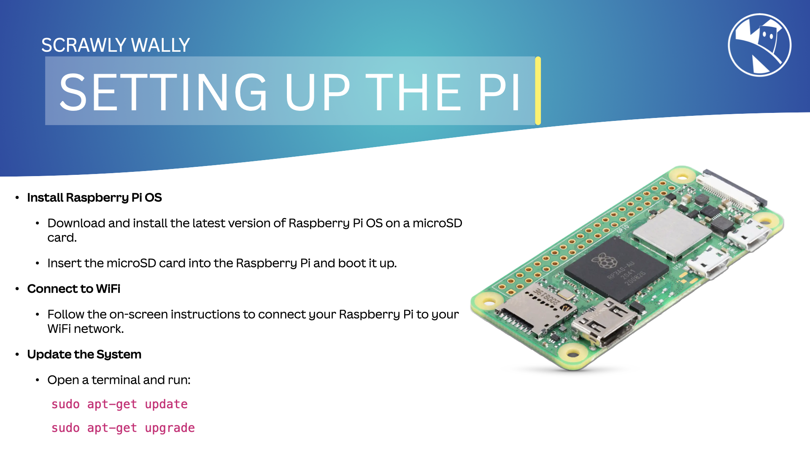

{:class="cover"}

---

## Setting Up the Raspberry Pi

Setup the Pi for the Scrawly Wally robot:

Item | Action
--- | ---
**Install Raspberry Pi OS** Download and install the latest version of Raspberry Pi OS on a microSD card. Insert the microSD card into the Raspberry Pi and boot it up.   **Connect to WiFi**: Follow the on-screen instructions to connect your Raspberry Pi to your WiFi network.   **Update the System**: Open a terminal and run: `sudo apt-get update && sudo apt-get upgrade`  **Enable I2C, SPI, and Serial Interfaces**: Run `sudo raspi-config` and enable the necessary interfaces. | {:class="w-100 img-fluid rounded-3 card-shadow card-hover"}
{:class="table table-striped"}

---

Your Raspberry Pi is now set up. Next, we'll install the software needed for the robot.

---
