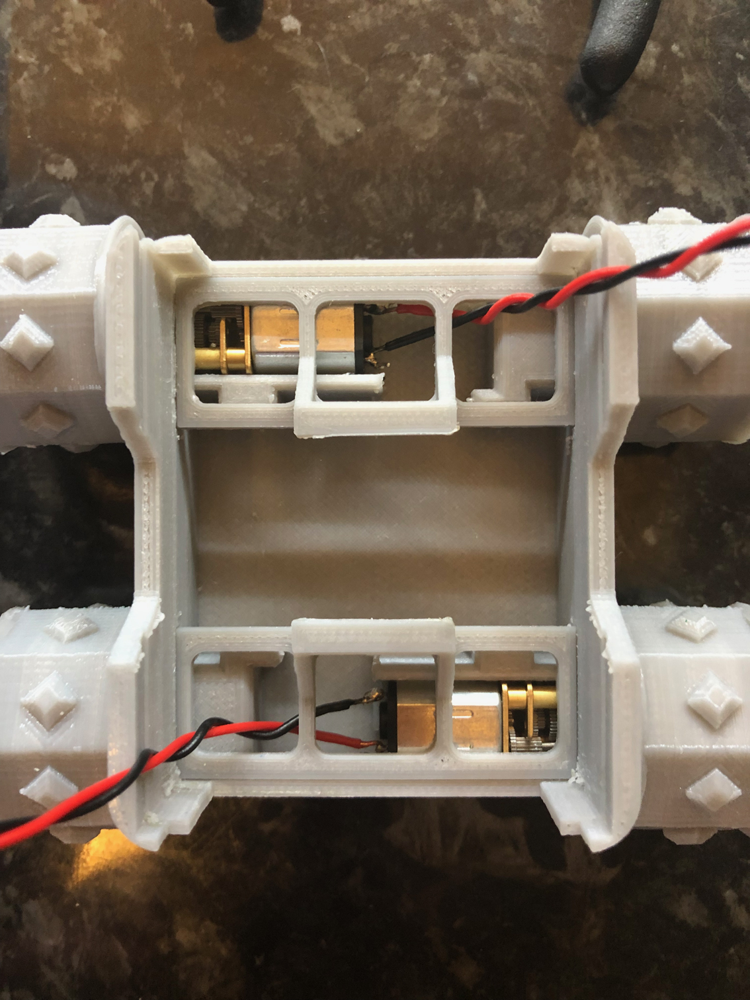

## Fit Motors Holders

The motors are kept in place by the motor holders. You will have to bend these slightly to insert them into the little recess just about the motors. It is also good practice to push the motor wires through these before inserting. This will make them fit snug and will allow the motor wires to be free and untrapped.

{:class="img-fluid w-50"}

---
