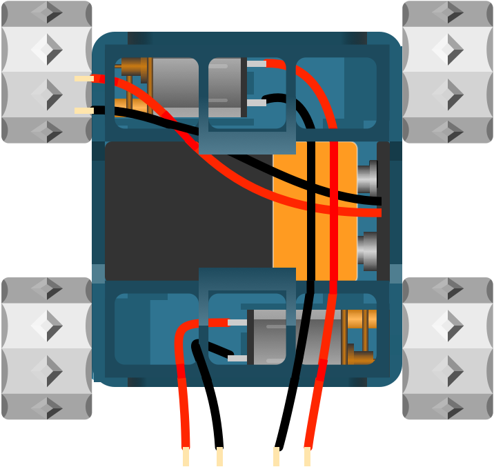

## Test Motors

Test the motors are working correctly by touching the positive and negative wires to the battery. They should spin enthusiastically!

---

## Troubleshooting

If the motors do not spin when connecting to the battery, check that the wires are still soldered to the motor and haven't come free when fitting (they are quite delicate). Also check the 9v battery is fully charged (you can put a 9v battery to your tongue and you will feel a slight shock on your tongue).

---

{:class="img-fluid w-50"}

---
