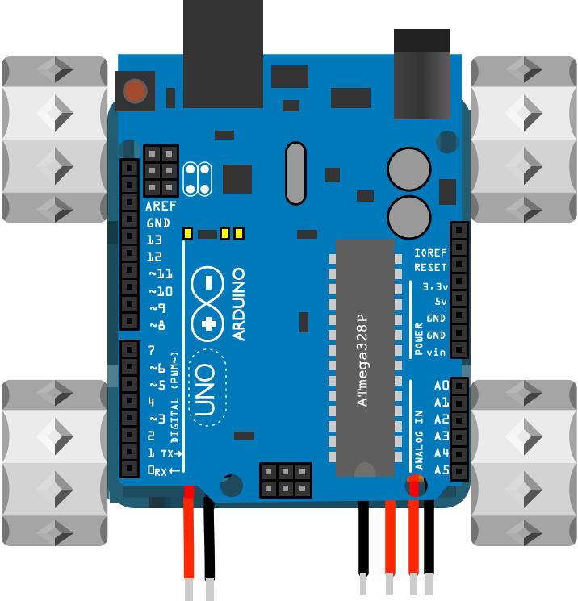

## Add ARDUINO

Slide the Arduino with motorshield attached into the robot chassis - there are two slots that run the length of the top of the SMARS chassis. To avoid splitting the top of the SMARS chassis, slowly insert the Arduino and stop and remove it if you encounter any resistance. Its best to sandpaper or file the channel if it is not large enough.

{:class="img-fluid w-50"}

---
