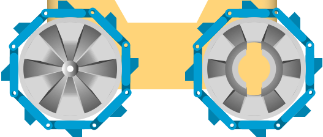
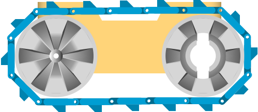

## Attach Tracks

To give the wheels more traction on different surfaces you can either attach the 8 tracks to each wheel, or attach 16 tracks to each side, in a caterpillar arrangement:

{:class="img-fluid w-50"}

The tracks are attached to each other by using a piece of filament.

{:class="img-fluid w-50"}

---

## Troubleshooting

You may find that the tracks are a really tight fit when connecting up in the caterpillar track formation. There are a couple of solutions to this:

* print another track at 110% - 120% scaling on the Y Axis
* use TPU / flexible filament, as this can stretch
* use a pre-sized piece from [Thingiverse](https://www.thingiverse.com/thing:3195991)

---
