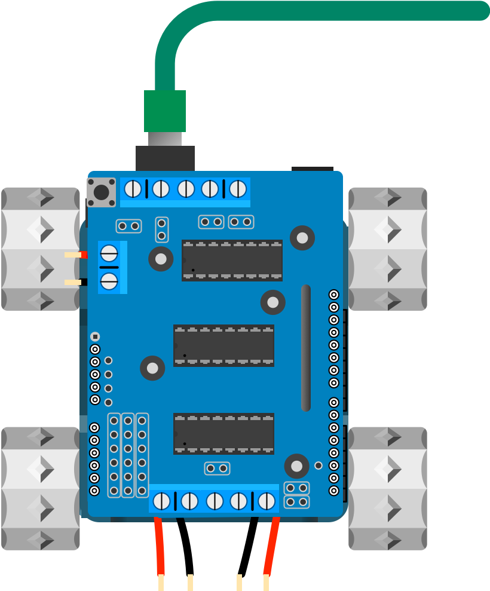

## Load the code

To bring your SMARS to life you need to write some code and upload it to your robot. [The Arduino IDE](https://create.arduino.cc/editor) makes loading the code easy.

The SMARSLab suite has Arduino code for controlling the SMARS via bluetooth. [Click here to download it](https://github.com/kevinmcaleer/SMARSLab/). More information about [SMARSLab is available here](https://www.smarsfan.com/code/python).

{:class="img-fluid w-50"}

---
