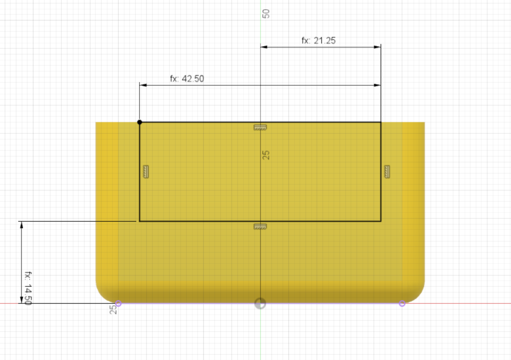

The Front and Back sides need to have a section cut out of them, first we need to create a profile for the cutout.

There are 2 main dimensions.

* Width = 42.5mm
* Height from bottom edge to the base = 14.5mm

{:class="img-fluid w-75 m-3"}

---
