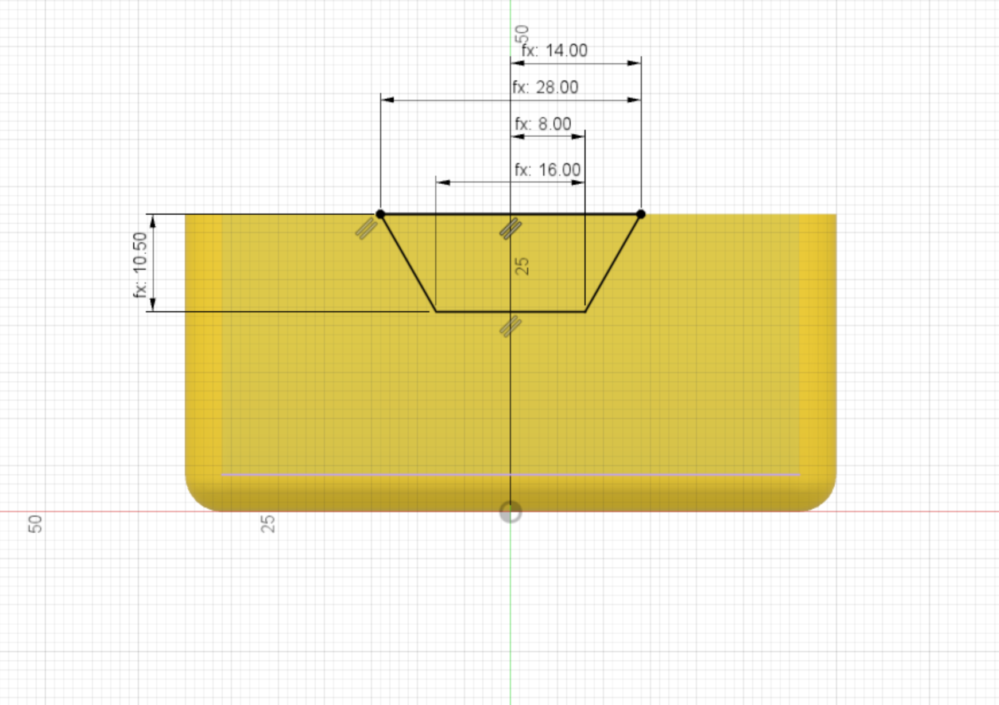

The profile for the side cutout is created next. This is a inverted trapesium shape, with three main dimensions:

* Top width = 28mm
* Bottom width = 16mm
* Depth = 10.5mm

{:class="img-fluid w-75 m-3"}

---
