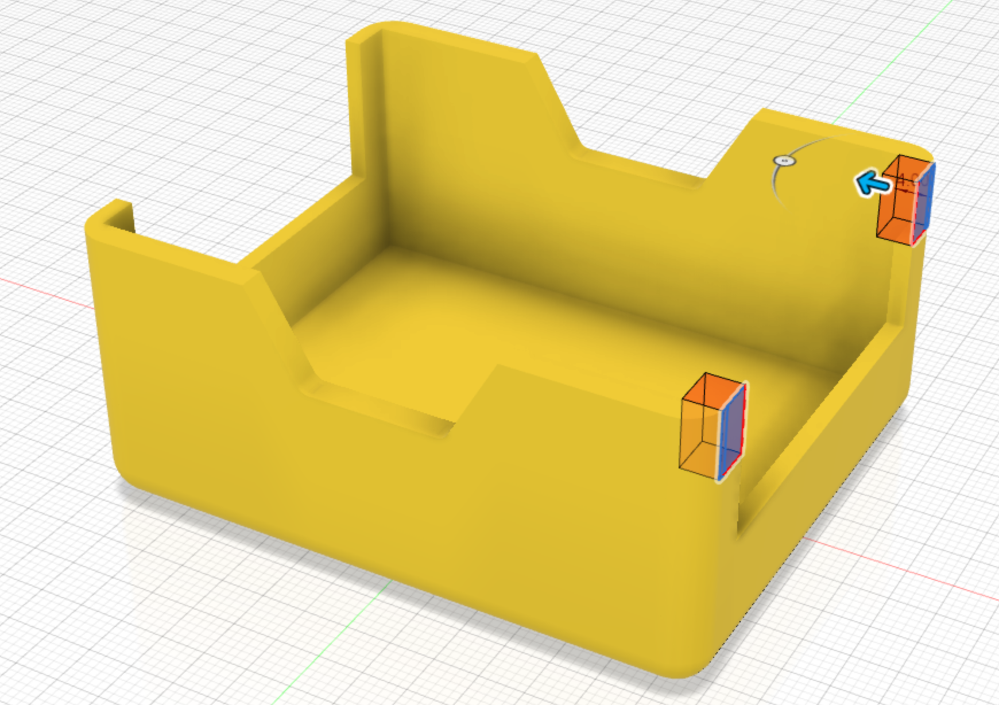

The [profile created above](11_back) is used to extrude a cut through the back side of the body. This is where the arduino will slide in. The slots will come shortly.

{:class="img-fluid w-75 m-3"}

---
