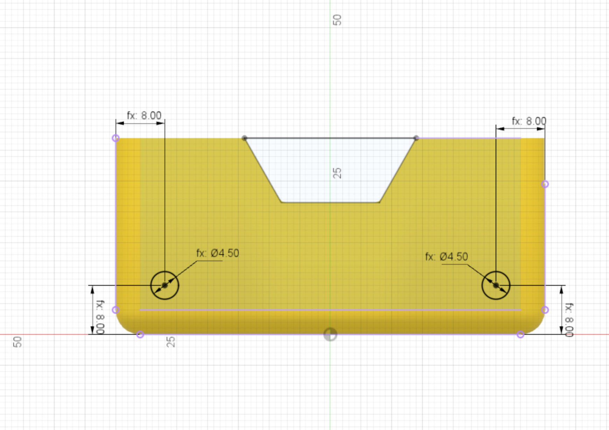

The profile for the wheel holes is created next. This has 2 dimensions:

* Hole diameter = 4.5mm (the motor spindle is 3mm so this is plenty of clearance)
* Hole centre from edge and bottom = 8mm

{:class="img-fluid w-75 m-3"}

---
