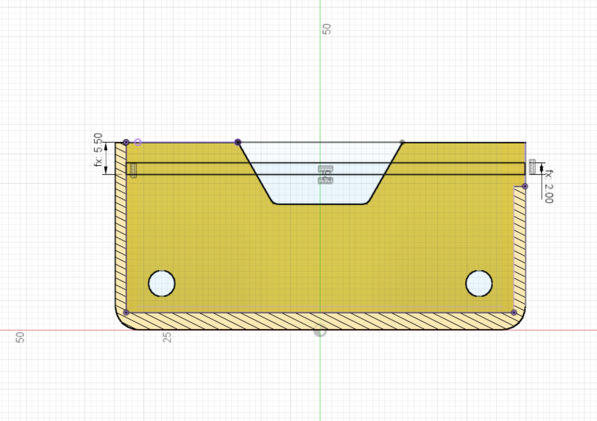

The slots for the arduino are sketched next. They go all the way from the back edge to the inner front edge. The dimensions of the Arduino slots are:

* Slot height = 2mm
* Body top to slot bottom edge = 5.5mm

{:class="img-fluid w-75 m-3"}

---
