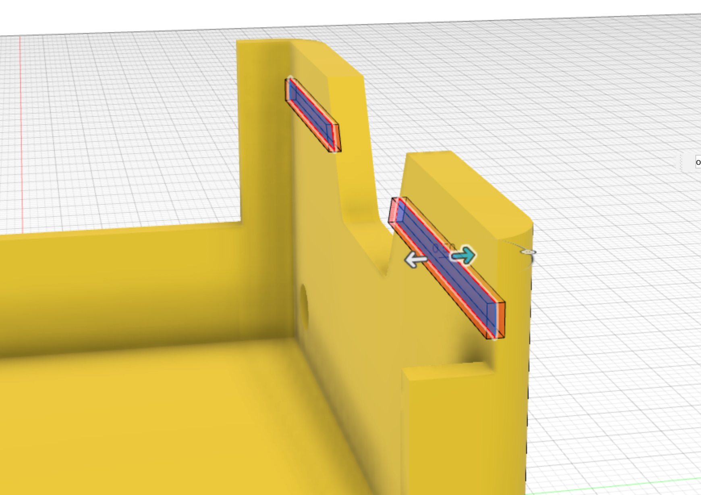

The [Arduino slot profile](15_slots) created previously is used to extrude a cut into the body, to a depth of 0.5mm.

* Arduino slot depth 0.5mm

This feature is mirrored across to the other side of the chassis.

{:class="img-fluid w-75 m-3"}

---
