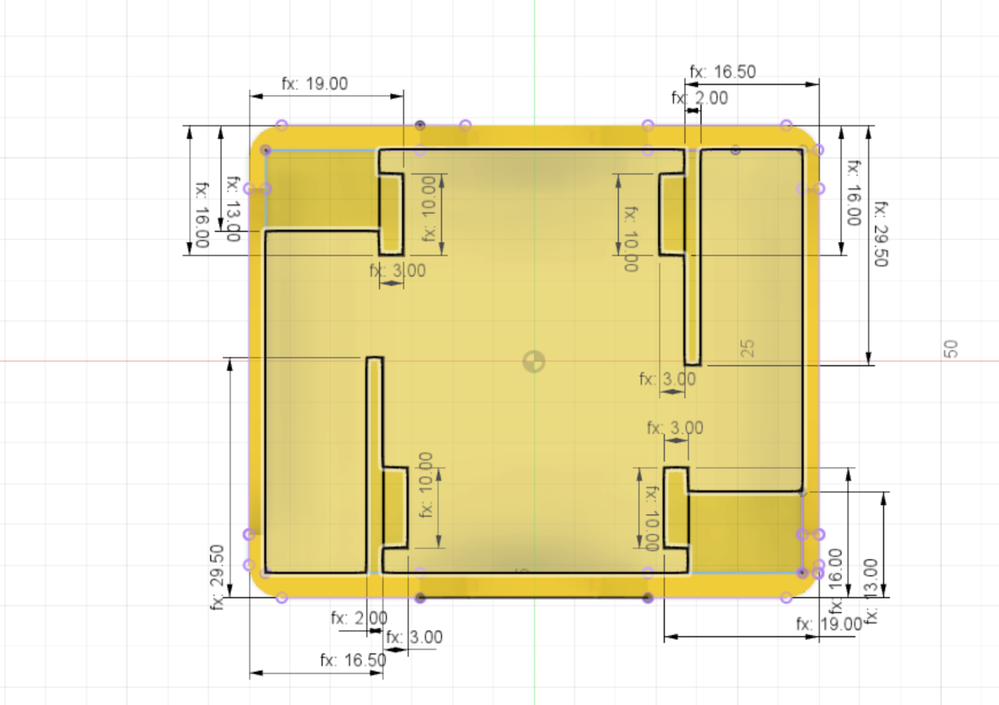

The profile for the motor holders within the body is created next.
There are a couple of dimensions on this sketch:

* motor holder side wall thickness = 2mm
* motor holder side wall edge from body edge = 16.5mm
* motor holder wall height = 29.50mm
* unpowered wheel block from case edge = 13mm
* unpowered wheel block and battery nub from edge = 19mm
* battery nub height = 10mm
* battery nub thickness = 3mm

The top half of the sketch can be created and then a circular pattern used to rotate this around the centre to create an asymetric mirror for the bottom half of the sketch.

{:class="img-fluid w-75 m-3"}

---
