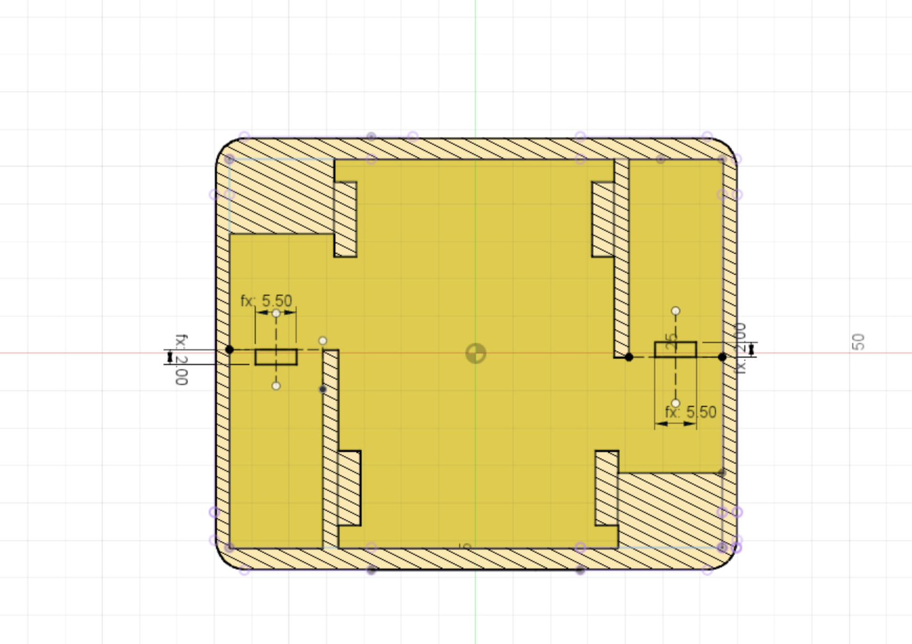

A small nub needs to be sketched - this is to prevent the motor from sliding backwards into the chassis body.

The dimensions are:

* motor nub height = 2mm
* motor nub width = 5.5mm

They are aligned to the top of the motor holder sides and centered with in that area.

{:class="img-fluid w-75 m-3"}

---
