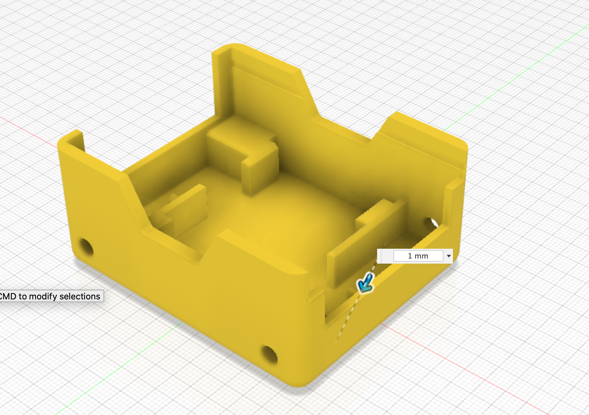

A small chamfer is applied to the tops of the extruded [motor holder profiles](17_motor) and [motor nubs](20_extrude).

The dimension of the chamfer is:

- motor holder chamfer = 1mm

{:class="img-fluid w-75 m-3"}

---
