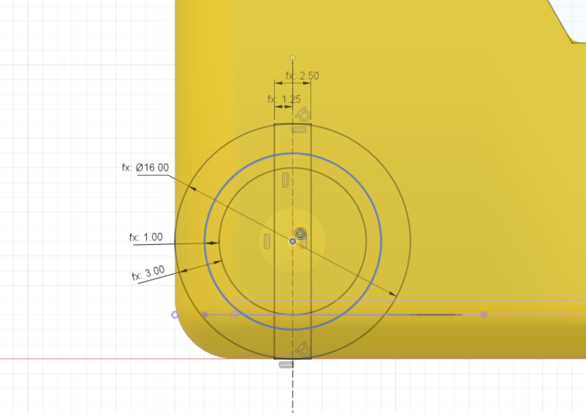

The unpowered wheel stub profile is sketched next.

This has several dimensions:

* stub diameter = 16mm
* stub inner diameter = 3mm (offset from stub diameter)
* stub flat diameter = 1mm (offset from the stub inner diameter)
* stub cut out slot width = 2.5mm

{:class="img-fluid w-75 m-3"}

---
