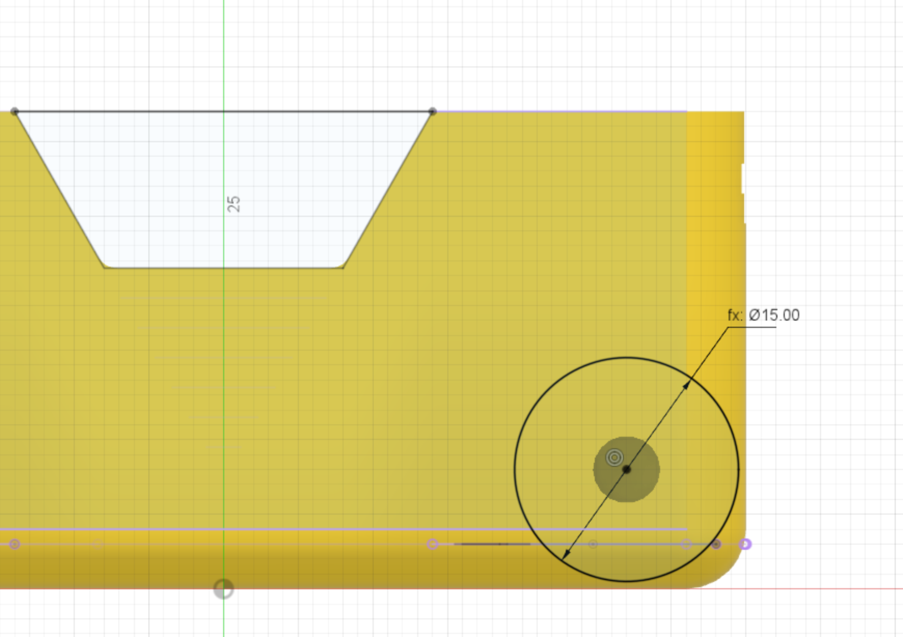

A small extrusion is needed to join the stub wheel to the fillet at the bottom of the chassis.

Dimension:

* stub wheel diameter = 15mm

The center of the circle is located at the centre of the previously extruded [motor hole](17_motor).

{:class="img-fluid w-75 m-3"}

---
