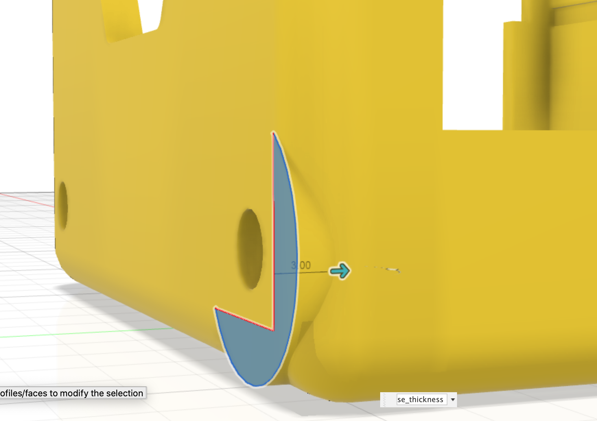

The [Stub extrude profile](24_stub) is extruded into the chassis body.
The dimensions are:

* stub extrude 3mm

This feature is replicated to the other side of the case using a circular pattern.

{:class="img-fluid w-75 m-3"}

---
