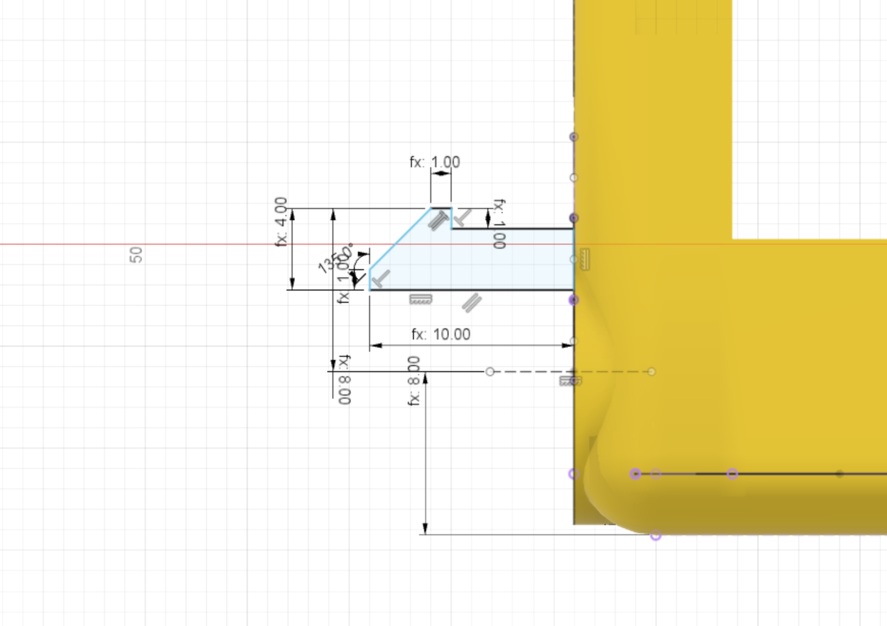

The stub wheel is actually created using a profile that is then revolved around an axis to form a rounded part.

This is a complex part to describe so please refer to the diagram below for dimensions.

{:class="img-fluid w-75 m-3"}

---
