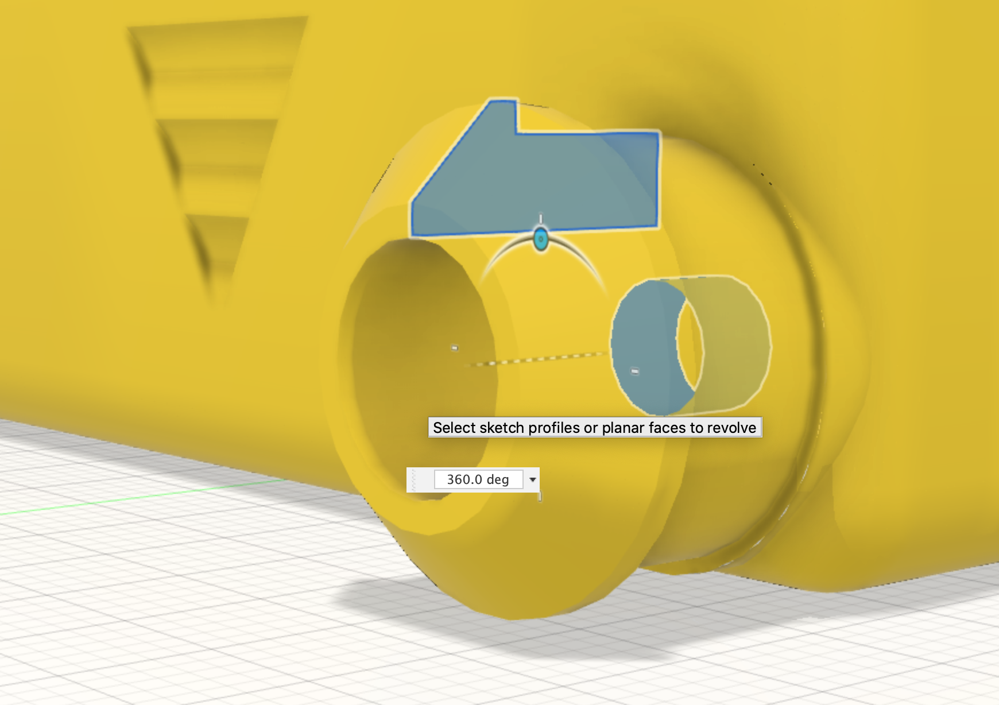

The [Stub wheel profile](27_stub) created above is revolved around the center of the wheel hole to create a solid body. The revolve operation also joins this to the chassis.

{:class="img-fluid w-75 m-3"}

---
