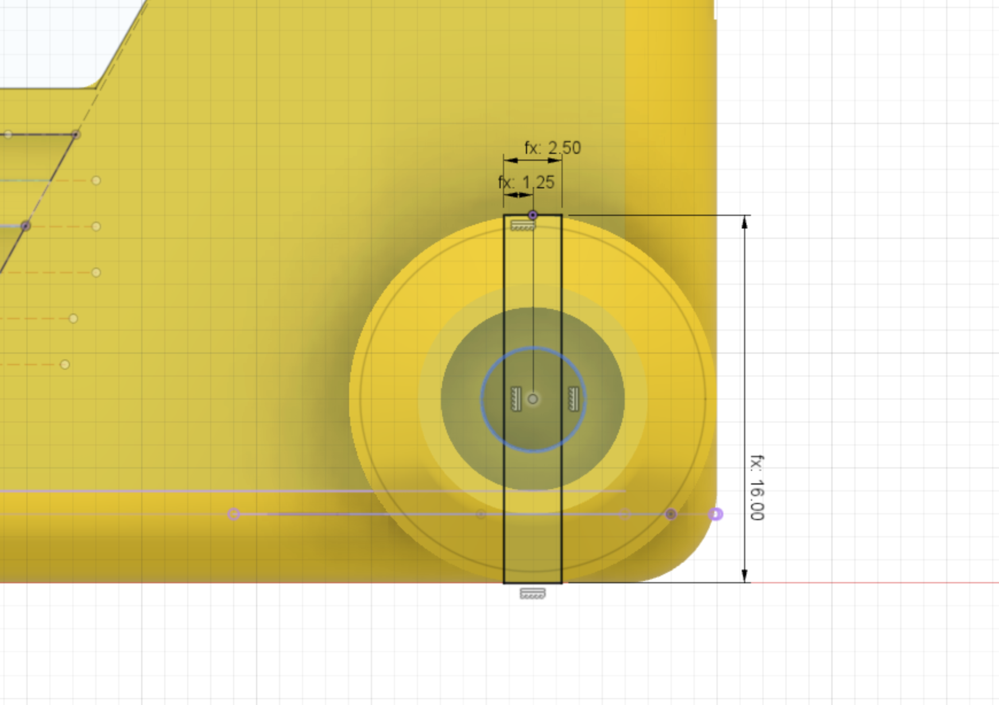

The stub wheel needs a cut out section to allow the two halfs of the stub wheel to squeeze together when pushing on an unpowered wheel.

The dimensions are:

* cutout width = 2.5mm
* cutout height = 16mm (the wheel diameter)

{:class="img-fluid w-75 m-3"}

---
