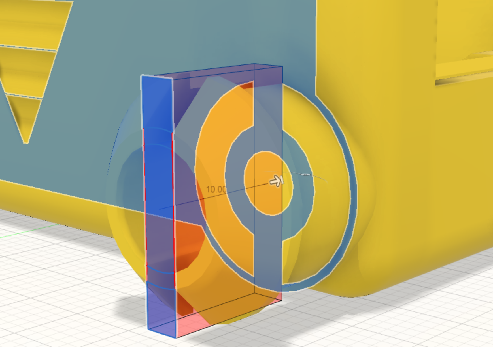

The [Stub wheel cutout profile](29_cut) is used to extrude-cut the section into the stub wheel to create two halfs.

The cut operation goes through the stub wheel to the surface of the side of the chassis body.

{:class="img-fluid w-75 m-3"}

---
