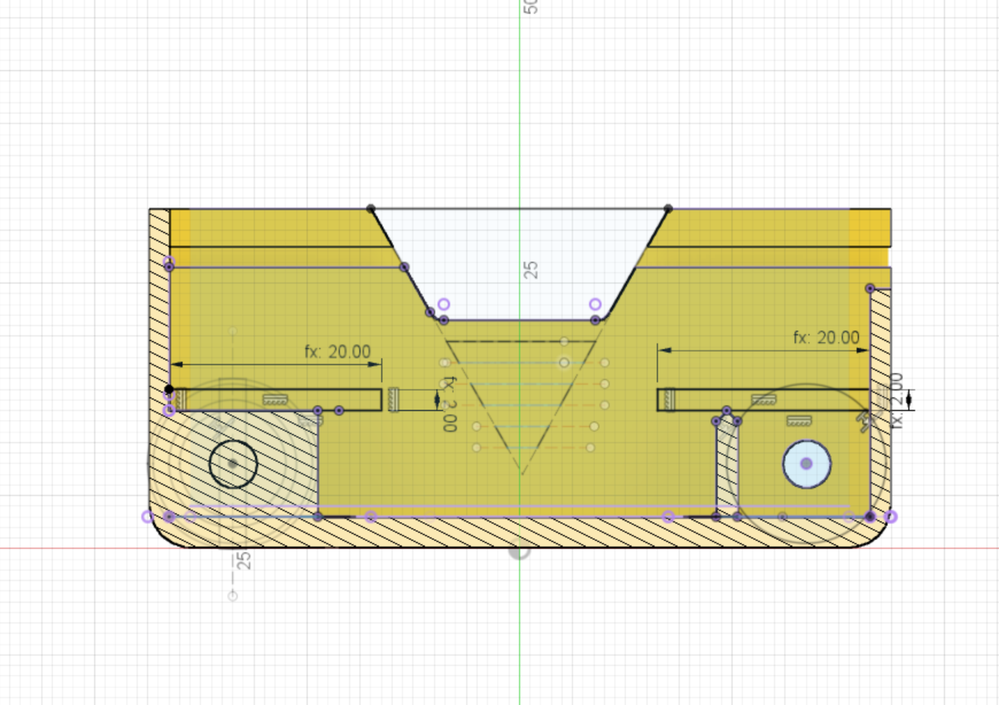

Two slot profiles need to be sketched above each of the areas where the motors live. This will enable a motor holder part to be snaped into place later once the motors are installed. The parts are pressure fit, so this part will only need to be a few mm deep.

Dimensions:

* length = 20mm
* depth = 2mm

{:class="img-fluid w-75 m-3"}

---
