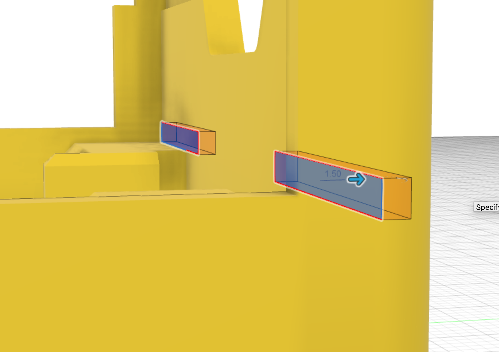

The [Motor holder slots profile](31_slots) is used to extMotrude-cut the slots into the chassis.

The dimensions for the cut are:

* extrude cut depth = 1.5mm

This feature is then mirrored across to the other side of the chassis.

{:class="img-fluid w-75 m-3"}

---
