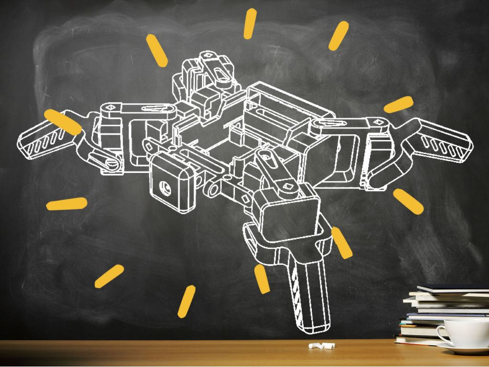

{:class="cover"}

## Overview

Learn how to Print, Wire, Assemble and Code a SMARS Robot.

---

## Bill of Materials

Item              | Description            | Qty |  Price
------------------|------------------------|:---:|------:
Raspberry Pi Zero | Raspberry Pi Zero 2 WH |  1  | £15.00
Servos            | SG90 Servos            |  8  |  £2.00
PCA9685           | PCA9685 Servo board    |  1  |  £3.00
{:class="table table-striped"}

---
