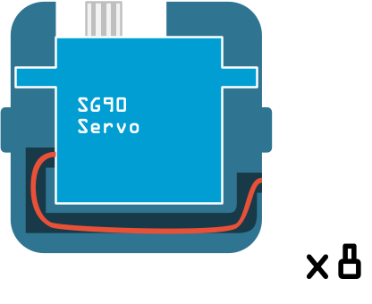

## 3 Fit the servo into the servo holder

The SG90 size servos will fit snuggly into the servo holder. You can push the servo wire into the channel within the holder to neatly guide the wire. If the type of servo you have has a wire that comes directly out of the bottom, you can easily clip away some of the channel wall so that the wire fits in.

{:class="img-fluid w-25"}

---
